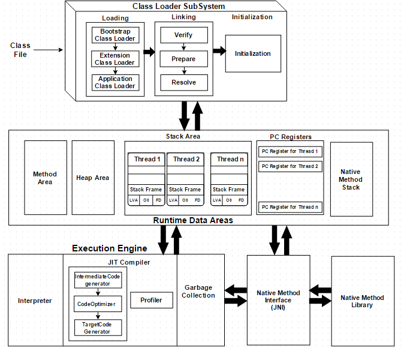
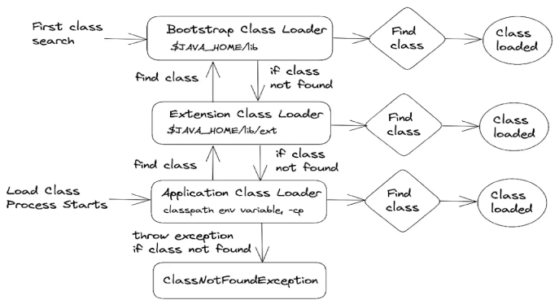

# Class loaders in Java

- [Class loaders in Java](#class-loaders-in-java)
  - [The classloader subsystem](#the-classloader-subsystem)
    - [Loading (Method area and Class instance in the heap)](#loading-method-area-and-class-instance-in-the-heap)
    - [Linking](#linking)
      - [Verification (.class corretness)](#verification-class-corretness)
      - [Preparation (static initialization - defalt values)](#preparation-static-initialization---defalt-values)
      - [Resolution (symbolic links resolution and verification)](#resolution-symbolic-links-resolution-and-verification)
    - [Initialization](#initialization)
  - [The class loader principles](#the-class-loader-principles)
    - [Delegation hierarchy principle](#delegation-hierarchy-principle)
    - [Visibility principle](#visibility-principle)
    - [Uniqueness principle](#uniqueness-principle)
  - [`java.lang.ClassLoader `class](#javalangclassloader-class)
    - [Source code](#source-code)
    - [`loadClass(String name)`](#loadclassstring-name)
    - [`findClass(String name)`](#findclassstring-name)
    - [`getResource(String name)`](#getresourcestring-name)
    - [`setDefaultAssertionStatus(boolean enabled)`](#setdefaultassertionstatusboolean-enabled)
    - [ClassLoader code example](#classloader-code-example)
  - [The class loader hierarchy](#the-class-loader-hierarchy)
    - [System/Application class loader](#systemapplication-class-loader)
      - [The `ClassNotFoundExcpetion` class](#the-classnotfoundexcpetion-class)
    - [Extension class loader](#extension-class-loader)
    - [Bootstrap class loader](#bootstrap-class-loader)
  - [Create a custom class loader](#create-a-custom-class-loader)
    - [Implementation](#implementation)

## The classloader subsystem

The classloader subsystem is an abstract class (`java.lang.class`) and is used for **loading, linking, and initialization** of the `.class` files(byte codes) into the *JVM Memory(Method area)* subsystem at **run-time**.



### Loading (Method area and Class instance in the heap)

The Class loader reads the `.class` file, generate the corresponding binary data and save it in the **method area** (the content of the class described in the memory management).

After loading the `.class` file, JVM creates an object of type `Class` **to represent this file in the heap memory**. Please note that this object is of type `Class` predefined in `java.lang` package. These `Class` object can be used by the programmer for getting class level information like the name of the class, parent name, methods and variable information etc. To get this object reference we can use `getClass()` method of Object class.

### Linking

Performs verification, preparation, and (optionally) resolution. 

#### Verification (.class corretness)
Checks that the loaded representation of a class is well-formed, with a proper symbol table. It also checks that the code that implements the class obeys the semantic requirements of the Java programming languague and the JVM. For example, it checks that every instruction has a valid operation code; that every branch instruction branches to the start of some other instruction, rather than into the middle of an instruction; that every method has a correct signature.

If verification fails, we get run-time exception `java.lang.VerifyError`. This activity is done by the component `ByteCodeVerifier`. Once this activity is completed then the class file is ready for compilation.

#### Preparation (static initialization - defalt values)

Involves creating the `static` fields (**class variables and constants**) for a class or interface and **initializings such fields to the default values**. This involves allocation of static storage and any data structures that are used internally by the implementation of the JVM, such as method tables.

#### Resolution (symbolic links resolution and verification)

It is the process of **checking symbolic references** from a class to other classes and interfaces, by **loading the other classes and interfaces that are mentioned**, and **checking that the references are correct**.

### Initialization

Initialization of a class consists of executing its **static initializers** and the **initializers for static fields** (class variables) declared in the class. The static initializers are executed in the order that they appear in the source code as shown in the code: when the JVM initializes the `Main` class, it first initializes all of its superclasses, starting with `Object`. Since `Object` has no superclass, the recursion stops there. 
Then, the JVM initializes Main by executing the class variable initializers and static initializers in the order that they appear in the source code.

```java
class Main extends Object {
  // Class variable initializers and static initializers are executed in this order
  static int x = 1;  // Initializer for static field x - executed first
  static int y;  // No initializer for static field y - executed second
  // Static initializer
  static {
    y = x + 1; //executed third
  }
  static int z = x + y;  // Initializer for static field z - executed fourth
  public static void main(String[] args) {
    // Main method is executed after the class is initialized
  }
}
```

In general, initialization of a class or interface `T` occurs when any of the following circumstances occurs:

* An instance of `T` is created
* A static method of `T` is invoked
* A static field of `T` is assigned
* A static field of `T` is used and the field is not a constant field

Also note that invocation of a method in a class via reflection causes initialization of the class
Once all classes are initialized, the JVM proceeds to instantiate the classes.


## The class loader principles

Java ClassLoader is followed by three basic principles:

### Delegation hierarchy principle

Class loaders follow the delegation model where,  a **ClassLoader instance will delegate the search of the class or resource to the parent class loader, before trying to find the class itself**.

**Let's** say we have a request to load an application class into the JVM. The system *application* class loader will first delegates the loading of that class to its parent (*extension*) which, in turn, will delegate to the *bootstrap* class loader.

For instance, in an application server, different applications may need different versions of the same class. The class loader delegation model makes it possible to meet these requirements without causing conflicts.

### Visibility principle

Class loaders in Java can have varying levels of visibility, which determines their ability to find and load classes from other class loaders. Java uses the following.

**Parent-first visibility**: The parent class loader is used first to load a class. If it cannot find the class, the child class loader is consulted.

Classes from the Application Classloader - those defined by the user - could use classes from the Extension or Bootstrap Classloader. But not the other way around. Similarly, classes from the Extension Classloader use classes from the Bootstrap Classloader. Classes from Bootstrap can't use classes from the extension - if they did, they would be included in the Bootstrap. Classes from the Application Classloader didn't even exist at the time the classes in the Bootstrap were written.

The level of visibility depends on the class loader hierarchy and the classpath, and it can have significant implications for application behavior. It's important to consider the visibility model used in an application to ensure that classes are loaded correctly and that classloading conflicts are avoided.

### Uniqueness principle

Java class loaders **keep different versions of the same class in separate namespaces**, which allows for creating multiple instances of a class with different versions. This is **useful for web applications that need to load shared libraries without conflicts**.

However, this feature can cause issues if not used carefully. If a class is loaded by two different class loaders, the **JVM will treat them as separate classes, and objects created from them will not be interchangeable**. This can lead to unexpected behavior if these objects are passed between methods expecting objects created by different class loaders.

To avoid these issues, **it is recommended to use a single class loader to load classes whenever possible. When multiple class loaders are used, take extra care to ensure that objects are not passed between classes with different namespaces**.

## `java.lang.ClassLoader `class

### Source code

```java
private final ClassLoader parent;

protected Class<?> loadClass(String name)
        throws ClassNotFoundException
    {
        synchronized (getClassLoadingLock(name)) {
            // First, check if the class has already been loaded
            Class<?> c = findLoadedClass(name);
            if (c == null) {
                long t0 = System.nanoTime();
                try {
                    if (parent != null) {
                        c = parent.loadClass(name, false); //the final attribute
                    } else {
                        c = findBootstrapClassOrNull(name);
                    }
                } catch (ClassNotFoundException e) {
                    // ClassNotFoundException thrown if class not found
                    // from the non-null parent class loader
                }
                if (c == null) {
                    // If still not found, then invoke findClass in order
                    // to find the class.
                    c = findClass(name);
                }
            }
            return c;
        }
    }
```

### `loadClass(String name)`

Loads a class with the specified name. It first checks if the class has already been loaded, and if not, it delegates the loading of the class to the parent class loader.

### `findClass(String name)`

Finds the class with the name you've specified. It is called by the `loadClass()` method if the parent class loader cannot find the class.

`getParent()`

Returns a class loader's parent class loader.

### `getResource(String name)`

Finds the resource with the name you have specified. It searches the classpath for the resource and returns a URL object that can be used to access the resource.

### `setDefaultAssertionStatus(boolean enabled)`

Enables or disables assertions for this class loader and all classes loaded by it.

### ClassLoader code example

This test shows the different class loaders being used for different classes

```java
@Test 
public void testClassLoaders() throws ClassNotFoundException { 
    ClassLoaderPrinter classLoaderPrinter = new ClassLoaderPrinter(); 
    classLoaderPrinter.printClassLoaders(); 
} 
 
private class ClassLoaderPrinter { 
 
    private Logger LOGGER = LoggerFactory.getLogger(ClassLoaderPrinter.class); 
 
    public void printClassLoaders() throws ClassNotFoundException { 
 
        LOGGER.info("Classloader of this class:" 
                + ClassLoaderPrinter.class.getClassLoader()); 
 
        LOGGER.info("Classloader of Logging:" 
                + Logging.class.getClassLoader()); 
 
        LOGGER.info("Classloader of ArrayList:" 
                + ArrayList.class.getClassLoader()); 
    } 
} 
```

This will produce the output

```java
Classloader of this class:sun.misc.Launcher$AppClassLoader@18b4aac2 
Classloader of Logging:sun.misc.Launcher$ExtClassLoader@7adf9f5f 
Classloader of ArrayList:null (Bootstrap classloader - null parent) 
```

## The class loader hierarchy



### System/Application class loader

**Loads classes from the application's classpath** (JAR, WAR etc...).

The application class loader is a standard Java class that loads classes from the directories and JAR files listed in the `CLASSPATH` environment variable or the -classpath command-line option. It loads the first class it finds if there are multiple versions.

The application class loader is the last class loader to search for a class. **If it can't find it, the JVM throws a `ClassNotFoundException`**. This class loader can also delegate class loading to its parent class loader, the **extension class loader**.

Aside from loading classes from the classpath, the application class loader also loads **classes generated at runtime**, like those created by the Java Reflection API or third-party libraries that use bytecode generation.

#### The `ClassNotFoundExcpetion` class

By looking at the stacktrace of the exception we can see what class loaders have been involved in the class search

```java
java.lang.ClassNotFoundException: com.myapp.classloader.SampleClassLoader at 
    java.net.URLClassLoader.findClass(URLClassLoader.java:381) 
    at java.lang.ClassLoader.loadClass(ClassLoader.java:424) 
    at java.lang.ClassLoader.loadClass(ClassLoader.java:357) 
    at java.lang.Class.forName0(Native Method) at 
    java.lang.Class.forName(Class.java:348)
```

### Extension class loader

Instead of the extension class loader, Java 9 and later versions use the `java.lang.ModuleLayer` class to **load modules from the extension directory**. The extension directory is now treated as a separate layer in the module system, and modules in the extension directory are loaded by the extension layer's class loader. Note that in Java 9 and later versions, it is recommended to use modules instead of the extension mechanism to share code between applications. The extension mechanism is still available for backward compatibility with older applications, but it is not recommended for new code.

### Bootstrap class loader

Also known as the *primordial* class loader, this is **the class loader where the search starts**. The bootstrap class loader is responsible for loading **core Java classes** such as `java.lang.Object` and `java.lang.String`. It is **implemented in native code** (C/C++) and classes are located in the `$JAVA_HOME/lib` directory.

## Create a custom class loader

In some special needs we would want to create a custom class loader. For example:

* if we need to **load class definitions over a network channel** (as internet browsers do)
* Creating classes dynamically suited to the user’s needs, e.g. in JDBC, **switching between different driver implementations is done through dynamic class loading**.
* Implementing a **class versioning mechanism while loading different bytecodes for classes with the same names and packages**. This can be done either through a URL class loader (load jars via URLs) or custom class loaders

### Implementation

The custom class loader shouldn't override the `loadClass` method because that would alter the delegation principle implemented in the abstract `ClassLoader` class (the source code above).
The custom logic should be implemented in the `findClass` method (since it is called only when the parent doesn't find the class definition).

```java
public class CustomClassLoader extends ClassLoader { 
 
    @Override 
    public Class findClass(String name) throws ClassNotFoundException { 
        byte[] classBytes = loadClassFromFile(name); 
        return defineClass(name, classBytes, 0, classBytes.length); 
    } 
 
    private byte[] loadClassFromFile(String fileName) throws ClassNotFoundException { 
        InputStream inputStream = getClass().getClassLoader().getResourceAsStream( 
                fileName.replace('.', File.separatorChar) + ".class"); 
        byte[] buffer; 
        ByteArrayOutputStream byteStream = new ByteArrayOutputStream(); 
        int nextValue = 0; 
        try { 
            while ( (nextValue = inputStream.read()) != -1 ) { 
                byteStream.write(nextValue); 
            } 
        } catch (IOException e) { 
            throw new ClassNotFoundException("Error loading the class file", e); 
        } 
        buffer = byteStream.toByteArray(); 
        return buffer; 
    } 
} 
```
