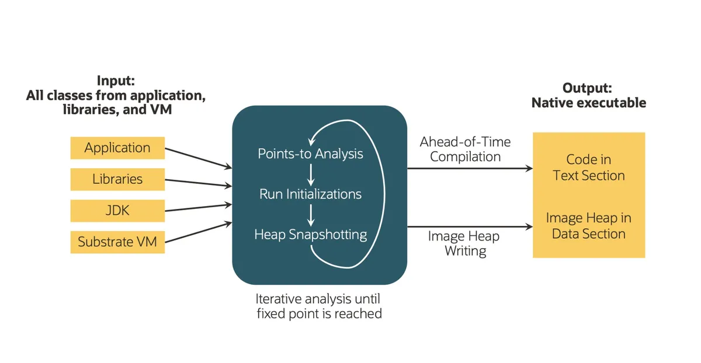

# Compilation in Java AOT, JIT and GraalVm

## Compiled and intepreted code

Usually, a compiled code is made of two processes, the **compilation** (the translation of the high level code into machine code) and the **run** (the execution of the machine code in the executing host). The **interpreted** codes are read and executed line by line (PHP, Ruby, Python, e JavaScript)

JAVA is a bit in the middle, because the source code is first **compiled** (using `javac`)  into a class file (see [Memory management doc](Memory Management.md) the for the structure of the class file).

```bash
$ javac HelloWorld.java
# output: HelloWorld.class
```

Since the JVM is platform-neutral, it uses an **interpreter** to execute bytecode

```bash
$ java HelloWorld
Hello Java!
```


## The *JVM* structure


### ClassLoader

See [Class loader doc](Class%20loaders.md)

### ClassLoader

See [Memory management doc](Memory Management.md)

Besides loading, the ClassLoader also performs linking and initialization. That includes:

* Verifying the bytecode for any security breaches
* Allocating memory for static variables
* Replacing symbolic memory references with the original references
* Assigning original values to static variables
* Executing all static code blocks

### Execution engine

The execution engine makes use of the [Native method interface (JNI)](https://www.baeldung.com/jni) to call native libraries and applications.

#### The JIT compiler

Improves performance by compiling bytecode to native code for repeated method calls. More details later

#### Garbage collector

See [Memory management doc](Memory Management.md)

#### Interpreter


Generally speaking, the interpreter scans the class file being executed (in the current stack frame - see [Memory management doc](Memory Management.md)), maintaining a **conversion table** between the class file instructions (platform independent) and the corresponding machine istructions (platform dependent).
The machine code is then transferred to the host cores for execution.


## The execution flow
<table>
<rd>
    <td></td>
</rd>
</table>

### Class loader :loading - linking - (static) initializing

In the diagram above we have the `.class` files loaded when they are requested by the running application. The class loader is also responsible of **loading, linking and initializing** the class. **Verification** is also done (correctness, consistency of class links etc...), so no further verification is needed at run-time (see the [Class loader doc](<Class loaders.md>)).

### Instantiating 

A new class instance is explicitly created when evaluation of a class instance creation expression is performed (`new` operator)

An **implicit instantiation** happens in the following conditions:

* Loading a class or interface that contains a **string literal** or a ** text block** may create a `new String` object
* Execution of an operation that causes **boxing conversion** may create a new object of a wrapper class. (Passing a primitive to method as a wrapper class)
* Execution of a **string concatenation** operation may create a `new String` object
* Evaluation of a **method reference expression** or a **lambda expression** may create a **new object of a functional interface**.

Here’s an example of creating a new instance of the class Point:

```java
Point magicPoint = new Point(42, 42);
```
#### Instantiation steps

* Memory is **allocated on the heap** to hold the new object
* The **class’s constructor is called** to initialize the new object
* The **reference to the new object is returned**

### Finalizing (instance)

Finalization is the process of **cleaning up the resources** held by an object (network sockets, IO streams...) and **preparing it for garbage collection**. The class `Object` defines a method finalize that **is called by the garbage collector when an object is about to be reclaimed**.

The JVM defines a finalize method in the Object class, which can be **overridden by subclasses to perform class specific cleanup actions** before the object is garbage collected. 

```java
public class TempFile {
  private File file;
  public TempFile(String filename) {
    file = new File(filename);
  }
  @Override
  protected void finalize() throws Throwable {
    // Delete the file when the TempFile object is garbage collected
    file.delete();
    super.finalize();
  }
}
```
### Unloading (class)

Unloading refers to the process of **removing a class or interface from the runtime state of the JVM** (e.g., its defining **class loader may be reclaimed by the garbage collector**).
The classloader can be unloaded together with all classes defined by it if the following conditions are met

* Classloader is unreachable
* there are no method stack frames of the methods of classes defined by the classloader
* there are no instances of the classes defined by the classloader

The most difficult problem to solve efficiently is to determine if instances of the classes exist.

### Program exit

Program exit refers to the process of **terminating the execution of a program**. This means that **all threads** that are not daemon threads **are terminated**, or some thread invokes the **exit method of the `Runtime` class**. This method halts the JVM and exit with a specified exit code. However, the use of this method is restricted by a security manager. If a security manager is present and it does not allow the program to exit, the exit method will throw a `SecurityException`.

## The JIT (*Just-In-Time*) compiler

The JDK implementation by **Oracle** is based on the open-source **OpenJDK** project. This includes the ***HotSpot virtual machine***, available since Java version 1.3.

A JIT compiler relies on the same well-known compilation techniques that an offline compiler such as the GNU Compiler Collection (GCC) uses. The primary difference is that **a just-in-time compiler runs in the same process as the application** and competes with the application for resources, because it is part of the **execution engine**. Mainly, compilation time is more of an issue for a JIT compiler than for an offline compiler, but new possibilities for optimization — such as *deoptimization* and *speculation* — open up, as well.

The JIT compiler's execution is transparent to the end user. It can, however, be observed by running the java command with diagnostic options.

Just-in-time (JIT) compilation is central to peak performance in modern virtual machines, but it comes with trade-offs. When one method is called **multiple times**, every time interpretation is required.

### HotSpot's JIT execution model


In practice, the HotSpot JVM's execution model is the result of four observations taken together:

Most code is only executed uncommonly, so getting it compiled would waste resources that the JIT compiler needs. **Only a subset of methods is run frequently**. The interpreter is ready right away to execute any code.
**Compiled code is much faster but producing it is resource hungry**, and it is only available after the compilation process is over which takes time.
The resulting execution model could be summarized as follows:

1. **Code starts executing interpreted with no delay**. The interpreter reads the bytecode from the Method Cache (Method area) and sends it to the JIT compiler. **it maintains a per-method count of the number of times a method is entered**. Because hot methods usually have loops, it also collects the number of times a branch back to the start of a loop is taken. On method entry, the interpreter adds the two numbers and if the result crosses a threshold, it enqueues the method for compilation.  
2. A compiler **thread running concurrently** with threads executing Java code then processes the compilation request. While compilation is in progress, **interpreted execution continues**, including for methods in the process of being JIT'ed. Once the compiled code is available it is saved in the **Code Cache**, **the interpreter branches off to it**. When the Code Cache is constrained (its usage approaches or reaches the `ReservedCodeCacheSize`), to compile more methods, the JIT must first throw out some already compiled methods. Discarding compiled methods are known as *Code Cache flushing*. 


As depicted in the image above, the code can also be **deoptimized** (invalidated in the code cache), for instance because the profiling has labelled the compiled code not valid anymore.

So, the trade-off is roughly between the *fast-to-start-but-slow-to-execute* **interpreter** and the *slow-to-start-but-fast-to-execute* **compiled code**. How slow-to-start that compiled code is, is under the virtual machine designer's control to some extent: The **compiler can be designed to optimize less** (in which case code is available sooner but doesn't perform as well) **or more** (leading to faster code at a later time). A practical design that leverages this observation is to have a multi-tier system.


### Multi-tiered execution

HotSpot has a **three-tiered** system consisting of:
* **Tier 1** - interpreter
* **Tier 2** - C1 - quick compiler 
* **Tier 3** - C2 - optimizing compiler 
 
Each tier represents a different trade-off between the delay of execution and the speed of execution. 


Java code starts execution in the interpreter. As the method goes through the different tiers, each tier gathers information about the method execution; this information is called **Profiling Data** (PD). Then, when a method becomes **warm**, it's enqueued for compilation by the quick compiler. Execution switches to that compiled code when it's ready. If a method executing in the second tier becomes **hot**, then it's enqueued for compilation by the optimizing compiler. Execution continues in the second-tier compiled code until the faster code is available. Code compiled at the second tier has to identify when a method becomes hot, so it also has to increment invocation and back-branch counters.


### Compilation levels

Even though the JVM works with only one *interpreter* and two *JIT compilers*, there are five possible levels of compilation. The reason behind this is that the C1 compiler can operate on three different levels. The difference between those three levels is in the amount of profiling done. 

<table>
<tr>
    <td><b>Level<b></td>
    <td><b>Description<b></td>
</tr>
<tr>
    <td>none (<b>0</b>)</td>
    <td>Interpreter gathering full PD</td>
</tr>
<tr>
    <td>simple (<b>1</b>)</td>
    <td>C1 compiler with no profiling </td>
</tr>
<tr>
    <td>limited profile (<b>2</b>)</td>
    <td>C1 compiler with light profiling gathering some PD </td>
</tr>
<tr>
    <td>full profile (<b>3</b>)</td>
    <td>C1 compiler with full profiling gathering full PD </td>
</tr>
<tr>
    <td>full optimization (<b>4</b>)</td>
    <td>C2 compiler with no profiling </td>
</tr>
</table>

#### Compilation levels configuration

* *–XX:-TieredCompilation* flag. The compilation will not switch levels. As a result, we’ll need to select which JIT compiler to use: C1 or C2. Thus CPU consumption will go down. However as side-effect your application’s performance can degrade

* *-XX:TieredStopAtLevel=N* If CPU spike is caused because of c2 compiler threads alone, you can turn-off c2 compilation alone. You can pass ‘-XX:TieredStopAtLevel=3’. When you pass this ‘-XX:TieredStopAtLevel’ argument with value 3, then only c1 compilation will be enabled and c2 compilation will be disabled.

## *AOT* (Ahead Of Time) compiler

AOT compilation is a form of **static compilation** that consists in transforming the program into a machine code **before it is executed**. This is the “old-fashioned” way in which the code in old programming languages such as C is statically linked and compiled. The machine code obtained as a result is tailored to a specific operating system and hardware architecture, facilitating a **very fast execution**. 

### The *close the world assumption*

The points-to analysis of the AOT compilation needs to “see” all the bytecode to work correctly. This limitation is known as the **close world assumption**. It means that all the bytecode in the application and their dependencies that can be called at runtime **must be known at build time** (observed and analyzed), i.e., when the native-image tool in GraalVM is building the standalone executable.

Consequently, **dynamic language capabilities** such as *Java Native Interface* (JNI), *Java Reflection*, *Dynamic Proxy* objects (java.lang.reflect.Proxy), or classpath resources (*Class.getResource*) are not supported.

### JIT vs AOT


## *GraalVM* Project and Architecture

**Project GraalVM** is a research project created by Oracle. We can look at Graal as several connected projects: a new JIT compiler that builds on HotSpot and a new polyglot virtual machine. It offers a comprehensive ecosystem supporting a large set of languages (Java and other JVM-based languages; JavaScript, Ruby, Python, R,  C/C++, and other LLVM-based languages).


GraalVM adds an advanced just-in-time (JIT) optimizing compiler, which is written in Java, to the HotSpot Java Virtual Machine. The GraalVM Compiler substitutes the standard JIT compilers (C2) and implements the JVMCI (Java Virtual Machine Command Interface, introduced in Java 9) to talk to the underlying implementation (JAVA HotSpot VM). You can still activate the C2 compiler through configuration of the VM. This can run all JVM based languages (JAVA, Scala).  

### *Truffle Language Implementation Framework* 

If we want to support other languages (JS, Ruby, Python…), we have to **translate all the language source into bytecode in order to be run in the JVM**. This is a maintenance nightmare. Then the Language Implementation Framework Truffle has been created to create **interpreters for the different languages, which is way easier than building a compiler for that language**. In other words, by using the Truffle Language Implementation Framework you can easily implement any language based on an https://en.wikipedia.org/wiki/Abstract_syntax_tree. And run all of them in the same runtime environment sharing the same memory. 

In addition to running Java and JVM-based languages, GraalVM’s Truffle language implementation framework makes it possible to **run JavaScript, Ruby, Python, and a number of other popular languages on the JVM**. With GraalVM Truffle, Java and other supported languages can directly **interoperate with each other and pass data back and forth in the same memory space**. In addition to that a **LLVM** compiler can be used on top of Truffle for **C** or **C++** code.  

At runtime all code interpreted is a **tree (or soup) of nodes**, no matter what language was use originally, so you can inline native extension code with dynamic code and interoperate with them.  

### *JVMCI* (JVM Compiler Interface) 

**What JVMCI actually allows us to do is to exclude the standard tiered compilation and plug in our brand new compiler (i.e. Graal) without the need of changing anything in the JVM.** All it needs to do is to implement

```java
public interface JVMCICompiler {
     /**
     * Services a compilation request. This object should compile the method to machine code and
     * install it in the code cache if the compilation is successful.
     */
    CompilationRequestResult compileMethod(CompilationRequest request);
}
```

The `CompilationRequest` class contains a `ResolvedJavaMethod` with all the metadata for the method to compile (methods, attribute, constants etc...). 
The `CompilationRequestResult` is used only to return a failure `CompilationRequestResult::getFailure`


### Graal – a JIT Compiler Written in Java

Let see the comparison of the top tiered (with C2) compiled code performance compared with Graal compiled code, based on the following code.

```java
public class CountUppercase { 

    static final int ITERATIONS = Math.max(Integer.getInteger("iterations", 1), 1); //Returns the integer value of the system property with the specified name, otherwise 1 

    public static void main(String[] args) { 
        String sentence = String.join(" ", args); 
        for (int iter = 0; iter < ITERATIONS; iter++) { 
            if (ITERATIONS != 1) { 
                System.out.println("-- iteration " + (iter + 1) + " --"); 
            } 
            long total = 0, start = System.currentTimeMillis(), last = start; 
            for (int i = 1; i < 10_000_000; i++) { 
                total += sentence 
                  .chars() 
                  .filter(Character::isUpperCase) 
                  .count(); 
                if (i % 1_000_000 == 0) { 
                    long now = System.currentTimeMillis(); 
                    System.out.printf("%d (%d ms)%n", i / 1_000_000, now - last); 
                    last = now; 
                } 
            } 
            System.out.printf("total: %d (%d ms)%n", total, System.currentTimeMillis() - start); 
        } 
    } 
} 

```

```bash
javac CountUppercase.java 
```
To activate Graal we add the option `+EnableJVMCI`

| Tiered compiler                                                                | Graal compiler                                                                 |
| ------------------------------------------------------------------------------ | ------------------------------------------------------------------------------ |
| `java -XX:+UnlockExperimentalVMOptions -XX:+EnableJVMCI -XX:-UseJVMCICompiler CountUppercase` | `java -XX:+UnlockExperimentalVMOptions -XX:+EnableJVMCI -XX:+UseJVMCICompiler CountUppercase` |
 
```bash
1 (510 ms) 
2 (375 ms) 
3 (365 ms) 
4 (368 ms) 
5 (348 ms) 
6 (370 ms) 
7 (353 ms) 
8 (348 ms) 
9 (369 ms) 
total: 59999994 (4004 ms) 
```

```bash
1 (1581 ms) 
2 (480 ms) 
3 (364 ms) 
4 (231 ms) 
5 (196 ms) 
6 (121 ms) 
7 (116 ms) 
8 (116 ms) 
9 (116 ms) 
total: 59999994 (3436 ms) 
```                                                                               
We can see that it **takes more time in the beginning**. That warm-up time depends on various factors, such as the **amount of multi-threaded code** in the application or the number of **threads the VM uses**. If there are fewer cores, the warm-up time could be longer. 

#### Graal compiler data structure

[GraalVM Graph Visualizer](https://www.graalvm.org/latest/tools/igv/)

Basic compiler's job, in general, is to act upon our program. This means that it must symbolize it with an appropriate data structure. Graal uses a graph for such a purpose, the so-called **program-dependence-graph**. 

In a simple scenario, where we want to add two local variables, i.e., `x + y`, we would have one node for loading each variable and another node for adding them. Beside it, we'd also have two **blue edges representing the data flow**: 


Let’s now introduce another type of edges, the **red edges that describe the control flow**. To do so, we’ll extend our example by calling methods to retrieve our variables instead of reading them directly. When we do that, we need to keep track of the **methods calling order**. We’ll represent this order with the red arrows:


Let's see now a simple example

```java
int average(int a, int b) {
    return (a + b) / 2;
}
```
and its graph


Parameters `P(0)` and `P(1)` flow into the `+` operation which enters the `/` operation with the constant `C(2)`. Finally, the result is returned.

Before continuing in the red control flow edge we have to resolve upward in the graph all the inputs for that operation before going on

```java
int average(int[] values) {
    int sum = 0;
    for (int n = 0; n < values.length; n++) {
        sum += values[n];
    }
    return sum / values.length;
}
```


This data structure is sometimes called a **sea-of-nodes**, or a **soup-of-nodes**. We need to mention that the C2 compiler uses a similar data structure, so it’s not something new, innovated exclusively for Graal.

It is noteworthy remember that **Graal optimizes and compiles our program by modifying the above-mentioned data structure**. We can see why it was an actually good choice to write the Graal JIT compiler in Java: a** graph is nothing more than a set of objects with references connecting them as the edges**. That structure is **perfectly compatible with the object-oriented language**, which in this case is Java.

## Graal Native image – AOT compiling

[Native Image](https://www.graalvm.org/latest/reference-manual/native-image/basics/) is an innovative technology that compiles Java code into a standalone binary executable or a native shared library (see JNDI document). The Java bytecode that is processed during the **native image build** includes all application classes, dependencies, third party dependent libraries, and any JDK classes that are required. This runs under the **close world assumption**: meaning that all accessible (byte)code should be reachable at compilation time, in order to do more complete and better optimization of the generated image.  A generated self-contained **native executable is specific to each individual operating systems** and machine architecture that does not require a JVM. 


### Points-to analysis. 
GraalVM Native Image **determines which Java classes, methods, and fields are reachable at runtime**, and only those will be included in the native executable. The points-to analysis starts with all entry points, usually the main method of the application. The analysis iteratively processes all **transitively reachable code paths until a fixed point is reached and the analysis ends**. This applies **not only to the application code but also to the libraries and JDK classes** — everything that is needed for packaging an application into a self-contained binary.


### Build Time initialization vs Run Time

During the image build, Native Image *may execute user code*. This code can have side effects, such as *writing a value to a static field of a class*. We say that this **code is executed at build time**.** Values written to static fields by this code are saved in the `image heap`**. Run time refers to code and state in the binary when it is executed.

The easiest way to see the difference between these two concepts is through configurable class initialization. **In Java, a class is initialized when it is first used**. Every **Java class used at build time is said to be build-time initialized**. Note that merely loading a class does not necessarily initialize it. The static class initializer of build-time initialized classes executes on the JVM running the image build. **If a class is initialized at build time, its static fields are saved in the produced binary**. **At run time, using such a class for the first time does not trigger class initialization**.

#### Example: run-time initialization

```java
public class HelloWorld {
    static class Greeter {
        static {
            System.out.println("Greeter is getting ready!");
        }
        
        public static void greet() {
          System.out.println("Hello, World!");
        }
    }

  public static void main(String[] args) {
    Greeter.greet();
  }
}
```
```bash
javac HelloWorld.java
java HelloWorld 
Greeter is getting ready!
Hello, World!
```

We see that the `Greeter is getting ready!` message is printed at **run time**.

We have the same if we build the native image

```bash
native-image HelloWorld
=============================================================
GraalVM Native Image: Generating 'helloworld' (executable)...
=============================================================
...
Finished generating 'helloworld' in 14.9s.
```
```bash
./helloworld 
Greeter is getting ready!
Hello, World!
```

#### Example: build-time initialization

By using the --initialize-at-build-time option we can activate the build-time (static)  initialization (the one made by the *classLoader*)

```bash
native-image HelloWorld --initialize-at-build-time=HelloWorld\$Greeter

==============================================================
GraalVM Native Image: Generating 'helloworld' (executable)...
==============================================================
Greeter is getting ready!
[1/7] Initializing...                                                                                    (3.1s @ 0.15GB)
 Version info: 'GraalVM dev Java 11 EE'
 Java version info: '11.0.15+4-jvmci-22.1-b02'
 C compiler: gcc (linux, x86_64, 9.4.0)
 Garbage collector: Serial GC
...
Finished generating 'helloworld' in 13.6s.
```
```bash
./helloworld 
Hello, World!
```

### Heap snapshotting

Heap snapshotting in Native Image is a very interesting concept and deserves its own article. During the image build process, **Java objects allocated by static initializers, and all the objects that are reachable, are written onto the image heap**. This means that your application starts much faster with a pre-populated heap.

Points-to analysis makes objects reachable in the image heap, and the snapshotting that builds the image heap can make new methods reachable for the points-to analysis. Thus, points-to analysis and heap snapshotting are performed **iteratively** until a fixed point is reached:




### Memory and CPU Usage in JIT and Native Image Modes


### Memory management in Native Image. 
The default garbage collector in an executable generated by Native Image is **Serial GC**, which is *optimal for microservices with a small heap*. There are also additional GC options available:

* **Serial GC** now has a new policy enabling survivor spaces for the young generation that reduces application runtime memory footprint. Since introducing this policy, we measured peak throughput improvements for a typical microservices workload such as Spring Petclinic of up to 23.22%.
* Alternatively, you can use the **low-latency G1 garbage collector** for even better throughput (available in GraalVM Enterprise). G1 is best suited for larger heaps

## The Native image potential drawbacks 

Because of the *close world assumption*, needed to the AOT compiling made by the *native-image* compiler, some of the dynamic features of JAVA (link) might not available at build time.

To overcome this limitation, GraalVM provides a [Tracing Agent](https://www.graalvm.org/22.0/reference-manual/native-image/Agent/) that **tracks all usages of dynamic features** of execution on a regular Java VM. During execution, the agent interfaces with the JVM and intercepts all calls that look up classes, methods, fields, resources, or request proxy accesses. The agent then generates the files `jni-config.json`, `reflect-config.json`, `proxy-config.json`, and `resource-config.json` in the specified output directory. The generated files are standalone configuration files in JSON format, which contain all intercepted dynamic accesses. **These files can be passed to the native-image tool so that the used classes will not be removed during the image build process**.

It is worth mentioning that the close work assumption **is good for security** as it eliminates the possibility of various code injections (e.g., the Log4j vulnerability that shocked the web in 2021 was possible due to the exploitation of the dynamic class loading mechanism in Java).


# TODO add the close world GraalVm solution in https://www.cesarsotovalero.net/blog/aot-vs-jit-compilation-in-java.html


https://docs.spring.io/spring-boot/docs/current/reference/html/native-image.html

https://www.graalvm.org/latest/reference-manual/native-image/basics/

https://quarkus.io/guides/writing-native-applications-tips


AOT vs. JIT Compilation in Java

here are two ways of compiling a Java application: using **Just in Time Compilation** (**JIT**) or **Ahead of Time Compilation** (**AOT**).
The first is the default mode, and it is used by the Java Hotspot Virtual Machine to translate bytecode into machine code at runtime. The latter is supported by the novel GraalVM compiler and allows statically compiling bytecode directly into machine code at build time.


https://www.cesarsotovalero.net/blog/aot-vs-jit-compilation-in-java.html //includes graal


https://www.dropbox.com/scl/fi/kumbqichotl1v1zavb2m2/Java-compiler-and-interpreters-with-JIT.docx?dl=0&rlkey=61c7oqrza5arolrfa4fy36wkp

https://www.graalvm.org/latest/reference-manual/java/compiler/

https://docs.spring.io/spring-boot/docs/current/reference/html/native-image.html