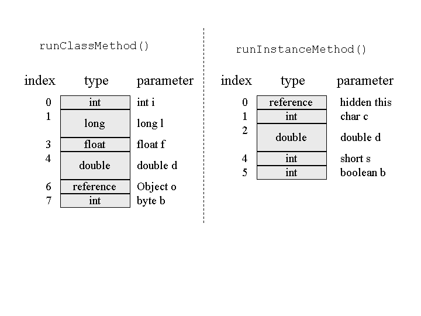
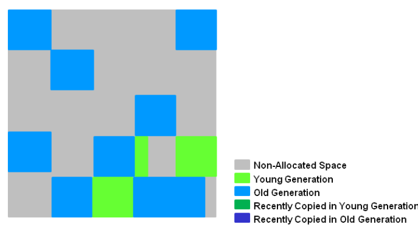

# Java Memory management

Table of content

- [Java Memory management](#java-memory-management)
  - [JVM Memory Structure](#jvm-memory-structure)
  - [Young generation memory - MinorGC](#young-generation-memory---minorgc)
  - [Old generation memory (tenured) - MajorGC](#old-generation-memory-tenured---majorgc)
  - [Metaspace (PermGen)](#metaspace-permgen)
  - [Heap](#heap)
    - [Method Area](#method-area)
    - [Memory pools](#memory-pools)
      - [Run-Time Constant Pool](#run-time-constant-pool)
    - [Compiled code structure](#compiled-code-structure)
      - [The *ClassFile* Structure](#the-classfile-structure)
      - [The constant pool](#the-constant-pool)
      - [The bytecode representation](#the-bytecode-representation)
  - [Stack](#stack)
    - [Native method stack](#native-method-stack)
    - [Stack and Heap usage](#stack-and-heap-usage)
    - [The stack frame](#the-stack-frame)
      - [Local Variables array](#local-variables-array)
      - [Operand Stack](#operand-stack)
      - [Frame data](#frame-data)
    - [Method execution example](#method-execution-example)
    - [Method's parameters passing](#methods-parameters-passing)
  - [String class in Memory - String pool](#string-class-in-memory---string-pool)
    - [String interning](#string-interning)
  - [Garbage Collection](#garbage-collection)
    - [Performance Metrics targeted by GC algorithms](#performance-metrics-targeted-by-gc-algorithms)
    - [Stop the world event - STW](#stop-the-world-event---stw)
    - [GC Algorithms](#gc-algorithms)
    - [The Garbage First G1 Garbage collector](#the-garbage-first-g1-garbage-collector)

Links

https://docs.oracle.com/javase/specs/jvms/se11/html/jvms-2.html

https://www.alibabacloud.com/blog/an-illustration-of-jvm-and-the-java-program-operation-principle_600307

https://deepsource.com/blog/jvm-method-invocation-control-flow //il totale

https://www.degruyter.com/document/doi/10.1515/comp-2020-0170/html (inside the JVM) //tools for jvm analysis

https://www.dropbox.com/scl/fi/cjweg82fz3tepp0xvm9ny/Java-Memory-management.docx?dl=0&rlkey=2o7qvhkifqa5u2mueda0qkvs7

https://www.baeldung.com/cs/memory-stack-vs-heap

https://www.geeksforgeeks.org/java-virtual-machine-jvm-stack-area/

https://amanagrawal9999.medium.com/the-ultimate-stack-frame-811c12f9ebf3 //example with stack frame

https://www.artima.com/insidejvm/ed2/jvm5.html
https://www.artima.com/insidejvm/ed2/jvm8.html //complete example with stack frame

Java Memory Management is divided into two major part :

* **JVM Memory Structure**
* **Working of the Garbage Collector**

## JVM Memory Structure

Memory structure is mainly made of the "**Young generation**" and "**Old generation**" depending on the scope of the garbage collector


## Young generation memory - MinorGC

**Eden space** is where all just created objects are stored. *Every thread has a dedicated segment of Eden space* (**ThreadLocal Allocation Buffer**) if full, Eden has a common area where move these objects. If it becomes full a **Minor GC** (minor garbage collector) is performed and ***all the survivor objects** are moved to one of the survivor spaces*. This means that the Eden Space is emptied after GC execution.

**Survivior space** is splitted into two sections *S0* and *S1*. *Only one of this area contains objects* ('from' role), the other one is always emtpy ('to' role).
**Minor GC** analyses survivor objects too and all survived object in the 'from' area are passed to the 'to' survivor section and the 'from' is emptied. Their roles are switched for the next gc exection (*Mark and copy* approach).

Object not deleted after a certain number of gc cycles (configurable trasholded age) are moved to old generation memory. Here there is no Mark and Copy but an approach of Mark, Sweep and Compact (reduce memory fragmentation)

## Old generation memory (tenured) - MajorGC

Old generation memory contains long lived object survived to many round of Minor GC. When it’s full a more time consuming **Major GC** is launched.

## Metaspace (PermGen)

Metaspace, formerly known as PermGen (Permanent Generation), is a non-heap memory area that stores **class metadata**, **constant pool information**, and **method bytecode**. It was introduced in Java 8 as a replacement for PermGen, which was removed due to memory management issues.

Unlike the heap and stack, metaspace **does not have a fixed size** and can grow dynamically. However, it is still essential to monitor its usage to avoid memory leaks and potential **OutOfMemoryError** exceptions.

## Heap

The Java Virtual Machine has a heap that is **shared among all Java Virtual Machine threads**. The heap is the run-time data area from which memory for all class instances and arrays is allocated.

If a computation requires more heap than can be made available by the automatic storage management system, the Java Virtual Machine throws an **OutOfMemoryError**.

### Method Area

The Java Virtual Machine has a method area that is shared among **all Java Virtual Machine threads**. It stores per-class structures such as the **run-time constant pool**, **field and method data, and the code for methods and constructors**, including the special methods used in class and interface initialization and in instance initialization These info are loaded by the classloader running in the JVM.

Although the method area is logically part of the heap, simple implementations may choose not to either garbage collect or compact it. This specification does not mandate the location of the method area or the policies used to manage compiled code. The method area may be of a fixed size or may be expanded as required by the computation and may be contracted if a larger method area becomes unnecessary. The memory for the method area does not need to be contiguous.

Caused **OutOfMemoryError** exceptions is allocation request cannot be satisfied.

### Memory pools

Memory pool contains collections of **immutable objects**. **String pool** is an example. It belongs to Heap or PermGen depending on JVM memory management implementaton. At **compile-time**, every string literal in the code (“” or new (“”)) is stored in the String pool.

#### Run-Time Constant Pool

The constant pool of a class is a sort of a key-value store containing entries for things like String constants, as well as references to all classes and methods that are referenced by the class.
The run-time constant pool for a class or interface is constructed when the class or interface is **created within the Method area**.

### Compiled code structure

The code below can be made readeble out of a `.class` file generated from a compiled JVM based source code (Java, Scala, Kotlin etc..)

#### The *ClassFile* Structure

A compiled class structure is the following:

```
ClassFile {
    u4             magic; //the magic number identifying the class file format; it has the value 0xCAFEBABE.
    u2             minor_version; //version of the class file
    u2             major_version; // M.m format 1.5 < 2.0 < 3.1
    u2             constant_pool_count; //the number of entries in the constant_pool table plus one. 
    cp_info        constant_pool[constant_pool_count-1]; //the constant pool structure, see below 
    u2             access_flags; // as specified here https://docs.oracle.com/javase/specs/jvms/se8/html/jvms-4.html#jvms-4.1-200-E.1
    u2             this_class; //the reference to this class name in the cp
    u2             super_class; //the reference to the super class name in the cp
    u2             interfaces_count; //the number of direct super interfaces 
    u2             interfaces[interfaces_count]; //
    u2             fields_count;
    field_info     fields[fields_count];
    u2             methods_count;
    method_info    methods[methods_count];
    u2             attributes_count;
    attribute_info attributes[attributes_count];
}
```

Each `ux` value is of size `x` bytes, so that `u4` is four bytes long.

For details go to https://docs.oracle.com/javase/specs/jvms/se8/html/jvms-4.html

From this java code

```java
public class Memory { 

  public static void main(String[] args) { // Line 1 
    int i=1; // Line 2 
    Object obj = new Object(); // Line 3 
    Memory mem = new Memory(); // Line 4 
    mem.foo(obj); // Line 5 
  } // Line 9 

  private void foo(Object param) { // Line 6 
    String str = param.toString(); //// Line 7 
    System.out.println(str); 
  } // Line 8 
} 
```

By running the javap
The output gives the

```bash
  javac Memory.java
  javap -c -v Memory
```

Here we get the `ClassFile` for the Java code above

```bash
Classfile /C:/Users/Alessandro/Downloads/Memory.class
  Last modified 28 ott 2023; size 575 bytes
  SHA-256 checksum 08ba4f89e346e76810b441a9d95758a9882a0bd7e7b6f689d25969606f0e3488
  Compiled from "Memory.java"
public class Memory
  minor version: 0
  major version: 65
  flags: (0x0021) ACC_PUBLIC, ACC_SUPER
  this_class: #7                          // Memory
  super_class: #2                         // java/lang/Object
  interfaces: 0, fields: 0, methods: 3, attributes: 1

{
  
  
}
```

#### The constant pool

It is loaded by the class loader in the run time constant pool area.

Caused **OutOfMemoryError** exceptions is allocation request cannot be satisfied.

Here is the constant pool for the `Memory` class (loaded by the classloader in the RuntimeConstant pool area)

```bash
Constant pool:
   #1 = Methodref          #2.#3          // java/lang/Object."<init>":()V
   #2 = Class              #4             // java/lang/Object
   #3 = NameAndType        #5:#6          // "<init>":()V
   #4 = Utf8               java/lang/Object
   #5 = Utf8               <init>
   #6 = Utf8               ()V
   #7 = Class              #8             // Memory
   #8 = Utf8               Memory
   #9 = Methodref          #7.#3          // Memory."<init>":()V
  #10 = Methodref          #7.#11         // Memory.foo:(Ljava/lang/Object;)V
  #11 = NameAndType        #12:#13        // foo:(Ljava/lang/Object;)V
  #12 = Utf8               foo
  #13 = Utf8               (Ljava/lang/Object;)V
  #14 = Methodref          #2.#15         // java/lang/Object.toString:()Ljava/lang/String;
  #15 = NameAndType        #16:#17        // toString:()Ljava/lang/String;
  #16 = Utf8               toString
  #17 = Utf8               ()Ljava/lang/String;
  #18 = Fieldref           #19.#20        // java/lang/System.out:Ljava/io/PrintStream;
  #19 = Class              #21            // java/lang/System
  #20 = NameAndType        #22:#23        // out:Ljava/io/PrintStream;
  #21 = Utf8               java/lang/System
  #22 = Utf8               out
  #23 = Utf8               Ljava/io/PrintStream;
  #24 = Methodref          #25.#26        // java/io/PrintStream.println:(Ljava/lang/String;)V
  #25 = Class              #27            // java/io/PrintStream
  #26 = NameAndType        #28:#29        // println:(Ljava/lang/String;)V
  #27 = Utf8               java/io/PrintStream
  #28 = Utf8               println
  #29 = Utf8               (Ljava/lang/String;)V
  #30 = Utf8               Code
  #31 = Utf8               LineNumberTable
  #32 = Utf8               main
  #33 = Utf8               ([Ljava/lang/String;)V
  #34 = Utf8               SourceFile
  #35 = Utf8               Memory.java
```

The constant pool is a dictionary of indexed constant values in the form

```
cp_info {
    u1 tag;
    u1 info[];
}
```

 Those values are referred by other parts of the class file

```
this_class: #7    // Memory
```

or from the constant pool itself

```
#24 = Methodref          #25.#26 //reference to System.out.println(str);  in the format Class.NameAndType => java/io/PrintStream.println(Ljava/lang/String;)V
#25 = Class              #27 
#26 = NameAndType        #28:#29 //name and type
#27 = Utf8               java/io/PrintStream
#28 = Utf8               println
#29 = Utf8               (Ljava/lang/String;)V
```

#### The bytecode representation

Format

```
offset: instruction arg1, arg2
```

contains bytecode instructions to be executed in the stack frame

```
public Memory();
    descriptor: ()V
    flags: (0x0001) ACC_PUBLIC
    Code:
      stack=1, locals=1, args_size=1
         0: aload_0
         1: invokespecial #1                  // Method java/lang/Object."<init>":()V
         4: return
      LineNumberTable:
        line 1: 0

  public static void main(java.lang.String[]);
    descriptor: ([Ljava/lang/String;)V
    flags: (0x0009) ACC_PUBLIC, ACC_STATIC
    Code:
      stack=2, locals=4, args_size=1
         0: iconst_1
         1: istore_1
         2: new           #2                  // class java/lang/Object
         5: dup
         6: invokespecial #1                  // Method java/lang/Object."<init>":()V
         9: astore_2
        10: new           #7                  // class Memory
        13: dup
        14: invokespecial #9                  // Method "<init>":()V
        17: astore_3
        18: aload_3
        19: aload_2
        20: invokevirtual #10                 // Method foo:(Ljava/lang/Object;)V
        23: return
      LineNumberTable:
        line 4: 0
        line 5: 2
        line 6: 10
        line 7: 18
        line 8: 23
```

The list of entries contains holes, e.g. from `2: new` to `5: dup` because the new instruction takes. The **offset number is stored in the PC** if that is the currrent instruction being executed

## Stack

Java stack memory is used for **every thread**’s execution. It stores primitive values, methods and object references stored in the heap (object useb by methods call references). Stack is implemented through a LIFO. Every time a method is invoked, a new stack frame is pushed. When the method ends, the block is unused
and stack goes to the next block. Stack size is way lower compared to Heap.

If the stack gets full a **StackOverflowException** is generated

### Native method stack

A native method is a method written in another programming language than Java. These methods aren't compiled to bytecode, hence the need for a different memory area. The Native Method Stack is very similar to the JVM Stack but is only dedicated to native methods.

### Stack and Heap usage

```java
public class Memory { 

  public static void main(String[] args) { // Line 1 
    int i=1; // Line 2 
    Object obj = new Object(); // Line 3 
    Memory mem = new Memory(); // Line 4 
    mem.foo(obj); // Line 5 
  } // Line 9 

  private void foo(Object param) { // Line 6 
    String str = param.toString(); //// Line 7 
    System.out.println(str); 
  } // Line 8 
} 
```

Below image shows the Stack and Heap memory with reference to above program and how they are being used to store primitive, Objects and reference variables.


Let’s see the steps of this program’s memory usage

When the program starts, the first call encountered is the main method at **LINE 1** (called by runtime environment).  A stack for the main thread is created in memory and the `main()` method is pushed in stack

At **LINE 2** we have a primitive variable and its value is pushed directly to the stack

At **LINE 3** and **LINE 4** the program created new class objects. Objects are created in heap memory and references to them are pushed into the stack

At **LINE 5** the `foo` method is call, so (as we seen before for main method) a block is created on top of the stack for the `foo` method. Since Java passes params by value, a new copy of reference to Object class will created in the `foo()` stack block

In **LINE 7** we have a new String trough the Object’s toString() method . It will be interned into the String pool (the value itself) and in the foo() stack block will be added a reference to this string in the pool.

At **LINE 8** `foo()` ends and the relative block in the stack becomes free

At **LINE 9** `main()` method terminates and all the stack allocated for thread is destroyed. Since the entire program terminates, Java Runtime ends the execution releasing al the allocated memory (stack, heap...)

Let’s check another code sample

```java
class Person {  
  int id;  
  String name;  

  public Person(int id, String name) {  
    this.id = id;  
    this.name = name;  
  } 

}  

public class PersonBuilder {  
  private static Person buildPerson(int id, String name) {  

  return new Person(id, name);  
  }  

  public static void main(String[] args) {  
    int id = 23;  
    String name = "John";  
    Person person = null;  
    person = buildPerson(id, name);  
  }
} 
```


### The stack frame

https://www.artima.com/insidejvm/ed2/jvm8.html

Every time a method is called in the bytecode, a stack frame is created and pushed to the stack.
The frame contains the follwing:

* **Local variables array**: zero based array, initialized with the reference to the heap for the executing class (`this` if it is an instance method) the method parameters and the internal variables. Each slot is 32 bit (a variable can use one or more slots)
* **Operand stack**: a stack of intermediate operand stored during method execution
* **Frame Data**: **Constant pool address**: the address to the constant pool of the class containing the invoked method

#### Local Variables array

Example:

```java
class Example3a {
    public static int runClassMethod(int i, long l, float f,
        double d, Object o, byte b) {
        return 0;
    }

    public int runInstanceMethod(char c, double d, short s,
        boolean b) {
        return 0;
    }
}
```



The reported references are the reference to the classes stored in the heap.
The first parameter in the local variables for `runInstanceMethod()` is of type *reference*, even though no such parameter appears in the source code. This is the *hidden* `this` reference passed to every instance method. Instance methods **use this reference to access the instance data of the object upon which they were invoked**. As you can see by looking at the local variables for `runClassMethod()`, class methods **do not receive a hidden this**.

Many primitive types are stored in the JVM as *int* for `byte`, `short`, `char`, and `boolean`.

#### Operand Stack

This is not an array but a stack; the Java virtual machine uses the operand stack as a work space. Many instructions pop values from the operand stack, operate on them, and push the result.
Other than the program counter, which can't be directly accessed by instructions, the **Java virtual machine has no registers**. It is stack-based rather than register-based because its instructions take their operands from the operand stack rather than from registers.

Let's take this example that sums two ints putting the result in another local variable:

```
iload_0    // push the int (operand) in local variable 0
iload_1    // push the int (operand) in local variable 1 and pushes to the operand stack
iadd       // pop two ints, add them, push result. Pops the two int values from the operand stack, adds them, and pushes the int result back onto the operand stack
istore_2   // pop int, store into local variable 2
```


#### Frame data

Java stack frame includes data to support **constant pool resolution**, normal **method return**, and **exception dispatch**

Whenever the Java virtual machine encounters any of the instructions that refer to an entry in the **constant pool**, it uses the frame data's pointer to the constant pool to access that information, that are initially symbolic (not yet resolved). If so, the virtual machine must resolve the reference at that time.

The frame data must assist the virtual machine in processing a normal or abrupt method completion. If a method completes normally (by returning), the virtual machine must **restore the stack frame of the invoking method**. It must set the **pc register to point to the instruction in the invoking method that follows the instruction that invoked the completing method**. If the completing method returns a value, **the virtual machine must push that value onto the operand stack of the invoking method**.

When a method throws an **exception**, the Java virtual machine uses the exception table referred to by the frame data to determine how to handle the exception. If the virtual machine finds a matching catch clause in the method's exception table, it transfers control to the beginning of that catch clause

### Method execution example

```java
class Example3c {

    public static void addAndPrint() {
        double result = addTwoTypes(1, 88.88);
        System.out.println(result);
    }

    public static double addTwoTypes(int i, double d) {
        return i + d;
    }
}
```


The virtual machine allocates enough memory for the `addTwoTypes()` frame from a heap. It then pops the double and int parameters (88.88 and 1) from `addAndPrint()`'s operand stack and places them into `addTwoType()`'s local variable slots one and zero.

When `addTwoTypes()` returns, it first **pushes the double return value** (in this case, 89.88) **onto its operand stack**. The virtual machine uses the information in the frame data to locate the stack frame of the invoking method, `addAndPrint()`. It pushes the double return value onto `addAndPrint()`'s operand stack and frees the memory occupied by `addTwoType()`'s frame. It makes `addAndPrint()`'s frame current and continues executing the `addAndPrint()` method at the first instruction past the `addTwoType()` method invocation (the PC points to the offset of the method instruction).

### Method's parameters passing

Java always passes parameter to method **by value**. In case of primitive variables the “value” is the value itself, so if we modify it into the method, the variable will change outside. If the parameter passed is an object instance, the value is the memory reference, i.e. a location memory in heap containing the instance. So, the “value” is the target of the reference, even if the reference passed to the method is a copy of the original calling code. 


The output of this program is 

```
red 
green
```

## String class in Memory - String pool

String in Java is part of language, hence is present in `java.lang` package. Internally is stored in an **array of chars**. JVM treats String in special way: it can be instantiate by new operator o directly between `""`. 

Every instantiated class is stored in a dedicated location in **memory pool**, because it’s ***IMMUTABLE***:  

Every method that manipulates strings, internally creates a copy of input string. 

Immutable objects are **thread safe** (no need of locking) 

### String interning 

Every time JVM loads a class, **every string literal is stored in the String pool** this operation is called *interning*. All repetition of the same literal in the code is referred to the same location in the pool because JVM automatically intern Strings. So, every thread access the string literal is sure to read always the same value, one of the reason why strings are immutable.  

String pool contains string literals stored in **compile-time** by JVM. Even in run-time we can intern strings with intern() method. While executing a program we can intern a list of string when we now this list stores a lot of string repetitions: all this repetition will be referenced to the same pool location (**PermGen**).  **If you create a string with the new operator an heap variable will be created, different from pool**. 

This operation will make `equals()` faster and `==` operator returns true. 

On the contrary, we must be aware that string pool is limited memory over the heap.  

The `intern()` method lookups the string in the pool. If an equal string is found it’s returned, if not found is created in the pool for future references. 
```java
aString = "A String"; //string literal interned by JVM `

String aConcatentatedString = "A" + " " + "String"; //concatenation of compile-time string pool literals

aString == aConcatentatedString : true //referred to the same location in pool

aString.equals(aConcatentatedString) : true
```
 <hr>

```java
private static char[] chars = {'A', ' ', 'S', 't', 'r', 'i', 'n', 'g'}; 
String aRuntimeString = new String(chars); //not interned by JVM , new operator 
aString == aRuntimeString : false 
aString.equals(aRuntimeString) : true 
String anInternedString = aRuntimeString.intern(); //interned string 
aString == anInternedString : true //because of the interned string 
aString.equals(anInternedString) : true 

 ```
<hr>

```java
String anExplicitString = new String("A String"); //not interned for new operator (stored in heap) 
aString == anExplicitString : false 
aString.equals(anExplicitString) : true

String firstArg = args[0]; //main argument, runtime string not interned 
aString == firstArg : false 
aString.equals(firstArg) : true 
String firstArgInterned = firstArg.intern(); //once interned string are == 
aString == anInternedString : true //because of the interned string 
aString.equals(anInternedString) : true 
```
## Garbage Collection 

Garbage collection is an automatic process running concurrently (in background) with the application. It represents a big advantage for using Java because memory allocation and deallocation in other languages, such as C, is manual. Its main task is to check if objects in memory are referenced in some execution point of the application and then delete unreferenced objects to claim memory space for future object allocation. 

### Performance Metrics targeted by GC algorithms
* **Throughput**: is the amount of work that can be done in a specified time unit. The GC algorithm which does more work in short time is preferable.
* **Latency**: is the time taken for a request to complete. The GC algorithm would try to make as little pauses as possible for Garbage collection so that the request doesn’t have to wait for garbage collection i.e. GC algorithm will not make any request/operation wait, it will try to complete the operation as fast as possible
* **Memory Footprint**: is the memory needed by a GC process for it to execute smoothly. If GC algo takes more memory, it means that we have less memory available for Heap.

These three metrics are interconnected and every GC algorithm occupies a specific poing in the following area

<div>

</div>

 ### Stop the world event - STW 

Every kind of GC triggers a “Stop the world event”: every application’s thread hang on until garbage collection completes. Since Minor GC analyzes short-live object, it’s very fast and doesn’t affect application performance, but Major GC checks all live object and can tank longer execution time. Because of STW event, Major GC can make application unresponsive for a sensible period, with possible timeout errors.  

Performance of major gc depends on the chosen strategy and relative tuning, so it’s very important for big data and interactive applications to pay attention to garbage collection settings. 

A really basic garbag collection approach has three steps: 

* **Mark** - identifies and mark objects in use (**referenced by stack calls**) 

* **Normal Deletion** - gc deletes unmarked objects to reclaim free space 

* **Delection with compacting** - all undeleted objects are stored together to reduce memory fragmentation and gain better performance. 

The separation between young and old generation memories allows a hierarchical approach for gc implementation divided into **Minor** and **Major** gc depending on the assumption that every new objects are most likely unused in the future and long lived objects are most likely to be in use in future calls.

### GC Algorithms

| Garbage collector                        | Focus area                 | Concepts                                                                       |
|------------------------------------------|----------------------------|--------------------------------------------------------------------------------|
| **Parallel** *-XX:+UseParallelGC*                                | Throughput                 | Multithreaded stop-the-world (STW) compaction and generational collection. It spawns N threads for **MinorGC** (N=n° cpu cores). **Major GC** use a single thread.  You can change the number of threads through JVM setting `-XX:ParallelGCThreads=n`      |
| **Garbage First (G1)** *-XX:+UseG1GC*                      | Balanced performance       | Multithreaded STW compaction, concurrent liveness, and generational collection. In **GraalVm** it can be used in Linux but not in the community edition  |
| **Z Garbage Collector** (**ZGC**) *-XX:+UseZGC* (since JDK 15) | Latency                    | The Z Garbage Collector (ZGC) is a scalable low latency garbage collector. ZGC performs all expensive work concurrently, without stopping the execution of application threads for more than a few milliseconds. It is suitable for applications which require low latency. Pause times are independent of heap size that is being used. ZGC supports heap sizes from 8MB to 16TB. Since ZGC is a concurrent collector a max heap size must be selected such that, <br>1) the heap can accommodate the live-set of your application, and <br> 2) there is enough headroom in the heap to allow allocations to be serviced while the GC is running. How much headroom is needed very much depends on the allocation rate and the live-set size of the application. In general, the more memory you give to ZGC the better. But at the same time, wasting memory is undesirable, so it’s all about finding a balance between memory usage and how often the GC needs to run.                                      |
| **Shenandoah** (since JDK 12)   **EXPERIMENTAL**             | Latency                    | Shenandoah is the low pause time garbage collector that reduces GC pause times by performing more garbage collection work concurrently with the running Java program. Shenandoah does the bulk of GC work concurrently, including the concurrent compaction, which means its pause times are no longer directly proportional to the size of the heap. Garbage collecting a 200 GB heap or a 2 GB heap should have the similar low pause behavior. https://www.baeldung.com/jvm-experimental-garbage-collectors      |
| **Serial** *-XX:+UseSerialGc*                                  | Footprint and startup time | Single-threaded STW compaction and generational collection. In **GraalVM** it is the **default** GC algorithm                    |
|**Epsilon** (since Java 11)| Latency| Epsilon is basically a passive or “**no-op**” collector, which means that it handles memory allocation but **doesn’t recycle it**! So, **when the heap runs out of memory, the JVM simply shuts down**. Basically, any garbage collector has an indirect impact on the performance of the user program. It’s very difficult to benchmark an application and understand the impact of garbage collection on it. Epsilon serves exactly that purpose. It simply removes the impact of a garbage collector and **lets us run the application in isolation**. But, this expects us to have a very clear understanding of the memory requirements of our application. Consequently, we can achieve better performance from the application. |

### The Garbage First G1 Garbage collector

It was introduced by Java 7 in order to replace CMS. G1 is *parallel concurrent and incrementally compacting* low-pause garbage collector. It operates differently from others gc implementations. It divides all heap memory in multiple same size regions. When it’s invoked, it first apply to the region with less live data (hence “Garbage First”)


| The heap structure |  |
|---|---|
| G1 splits the heap into many (~ 2k varying in size from 1 to 32Mb) memory areas to store all generations of objects |  |


| The heap allocation |  |
|---|---|
| Each region has a role assigned (Eden, Survivor or Old). Live objects are evacuated (i.e., copied or moved) from one region to another. Regions are designed to be collected in parallel with or without stopping all other application threads. |  |

| Youg Generation GC |  |
|---|---|
| Live objects are evacuated (i.e., copied or moved) to one or more survivor regions (from green to dark green). If the aging threshold is met, some of the objects are promoted to old generation regions. This is a **stop the world (STW)** pause, done in **parallel using multiple threads**. Eden size and survivor size is calculated for the next young GC.|  |


| Old Generation GC Phases: | Initial Marking Phase |
|---|---|
| This is a **stop the world event**. With G1, it is **done with a normal young GC**. Mark survivor regions (root regions) which **may** have references to objects in old generation. Then, it **scan survivor regions for references into the old generation**. This happens while **the application continues to run**. The phase must be completed before a young GC can occur. In the logs: `pause (young)(inital-mark)`|  |

| Old Generation GC Phases: | Concurrent Marking Phase |
|---|---|
| **Find live objects over the entire heap**. This happens **while the application is running**. This phase **can be interrupted by young generation gc**. Empty regions (as denoted by the "X") are also marked , they are removed immediately in the Remark phase. Also, "**accounting**" information that determines liveness is calculated. |  |

| Old Generation GC Phases: | Remark Phase |
|---|---|
| Completes the **marking of live objects in the heap** with a **STW**. **Empty regions** are removed and reclaimed. Region liveness is now calculated for all regions. |  |

| Old Generation GC Phases: | Cleanup Phase |
|---|---|
| 1) Selects the regions with the lowest "liveness", those regions which can be collected the fastest (**garbage first**). (Stop the world) <br> 2) Then those regions are collected at the same time as a young GC. So both young and old generations are collected at the same time. (Stop the world) <br> 3) Reset the empty regions and return them to the free list. (Concurrent) <br> This is denoted in the logs as [`GC pause (mixed)`]. <br> The regions selected have been collected and compacted into the dark blue region and the dark green region shown in the diagram.|  |

