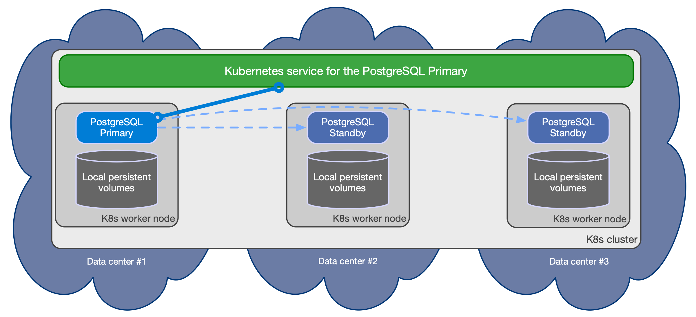
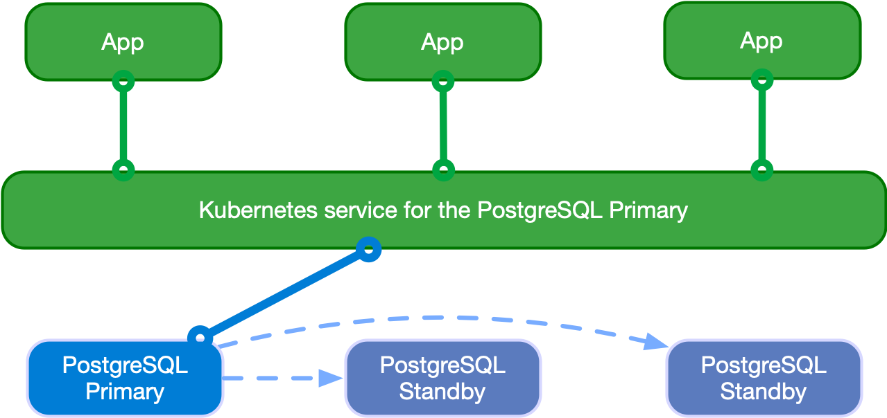

# 02-CloudNativePG Architecture

## Kubernetes StatefulSet

`StatefulSet` is a way to deploy a database in the Kubernetes cluster.
`Stateful` is a controller similar to `Deployment`

A stateful application expects **primary-replica architecture** and a fixed Pod name.
The StatefulSets controller addresses this problem while deploying the stateful application in the Kubernetes cluster.

### Stateful application as database implementation

**Stateful applications** are applications that store data and keep tracking it.
All databases, such as MySQL, Oracle, and PostgreSQL, are examples of stateful applications.
Stateless applications, on the other hand, do not keep the data. Node.js and Nginx are examples of stateless
applications.


### `StatefulSet`

`StatefulSets` assign a **sticky identity** (an ordinal number starting from zero) to each `Pod` (instead of assigning
random IDs for each replica `Pod`).
A new `Pod` is created by **cloning the previous Pod’s data**. If the previous `Pod` is in the pending state, then the
new Pod will not be created.
If you delete a `Pod`, it will **delete the Pod in reverse order, not in random order**.
For example, if you had four replicas and you scaled down to three, it will delete the Pod numbered 3 first.

The diagram below shows how the Pod is numbered from zero and how Kubernetes `PV` is attached to the `Pod` in
the `StatefulSets`.


On advantage of `StatefulSet`s is that we can define a **primary `Pod`**; this is possible because pods have unique ids
assigned.
A database implemented as StatefulSet can define a primary pod as the only one for read-write operations, while the
other ones
can be used as **replica `Pod`** (the n-th clones data from n-1-th pod).


If one POD dies (`mysql-2`) the StatefulSet guarantees that the `PV` (`data/vol/pv2`) is not cancelled and that a new
Pod is created
with the same sticky ID, bean attached to the same `PV`, (replicating data from `mysql-1`).

If a new POD is added, it will be assigned with the next sticky ID (`mysql-3`) and it will replicate data from the previous (`mysql-2`)

To summarize

1. Ordered numbers for each Pod
1. The first Pod can be a primary, which makes it a good choice when creating a replicated database setup, which handles both reading and writing
1. Other Pods act as replicas
1. New Pods will only be created if the previous Pod is in running state and will clone the previous Pod’s data
1. Deletion of Pods occurs in reverse order

## Synchronizing the state in CloudNativePG

PostgreSQL is a database management system and, as such, it needs to be treated as a **stateful workload** in Kubernetes.
While stateless applications mainly use **traffic redirection** to achieve _High Availability_ (HA) and _Disaster Recovery_ (
DR), in the case of a database, state must be replicated in multiple locations, preferably in a continuous and
instantaneous way, by adopting either of the following two strategies:

* **storage-level replication**, normally persistent volumes
* **application-level replication**, in this specific case PostgreSQL

**CloudNativePG relies on application-level replication**, for a simple reason: the PostgreSQL database management system
comes with **robust and reliable built-in physical replication capabilities based on Write Ahead Log (WAL)** shipping, which
have been used in production by millions of users all over the world for over a decade.

For this reason, PostgreSQL does not use internally `StatefulSet`, but normal `Deployment` with `CRD`s.

PostgreSQL supports both **asynchronous and synchronous streaming replication** over the network, as well as **asynchronous
file-based log shipping** (normally used as a fallback option, for example, to store WAL files in an object store).

Replicas are usually called **standby servers** and can also be used for **read-only workloads**, thanks to the **Hot Standby**
feature.

**NOTE**: It is recommended not to use  storage-level replication with PostgreSQL, although CloudNativePG allows you to adopt that strategy. 

### The Write-Ahead-Log
https://www.crunchydata.com/blog/postgres-wal-files-and-sequuence-numbers

The **Postgres Write Ahead Log (WAL)** is a functional component to the database. 
WAL makes a lot of key functionality possible, like _Point-in-Time-Recovery_ _backups_, recovering from an event, 
_streaming replication_, and more. From time to time, those deep inside the database will need to work directly with WAL files to diagnose or recover.


WAL's central concept is that changes to data files (where tables and indexes reside) must be **written only after those changes have been logged**, 
that is, after WAL records describing the changes have been flushed to permanent storage. 
If we follow this procedure, we do not need to flush data pages to disk on every transaction commit, because we know that in the event of a crash we will be able to recover the database using the log: 
any changes that have not been applied to the data pages can be redone from the WAL records. (This is roll-forward recovery, also known as REDO.)

The Postgres WAL (Write-Ahead Log) is the location in the Postgres cluster where all changes to the cluster's data files are recorded before they're written to the heap. 
When recovering from a crash, the WAL contains enough data for Postgres to restore its state to the last committed transaction. WAL Archiving is simply the process of backing up these WAL files.

That's why it is important that **WAL is stored on a separate location where the table are stores**. **Aws S3 can also be used**.

#### WAL file naming and structure

Transactions in PostgreSQL create **WAL records** which are ultimately **appended to the WAL log (file)**.

The position where the insert occurs is known as the **Log Sequence Number (LSN)**.

The values of LSN (of type `pg_lsn`) _can be compared to determine the amount of WAL generated between two different offsets (in bytes)_.

When using in this manner, it is important to know the calculation assumes the full WAL segment was used (16MB) if multiple WAL logs are used.
A similar calculation to the one used here is often used to determine latency of a replica.

The **LSN** is a **64-bit integer**, representing a **position in the write-ahead log stream**.
This 64-bit integer is split into two segments (high 32 bits and low 32 bits).
It is printed as two hexadecimal numbers separated by a slash (`XXXXXXXX/YYZZZZZZ`).
The `X` represents the high 32-bits of the LSN and `Y` is the high 8 bits of the lower 32-bits section.
The `Z` represents the offset position in the file.
Each element is a hexadecimal number. 

The `X` and `Y` values are used in the second part of the WAL file on a default PostgreSQL deployment.

The `pg_current_wal_lsn` is the location of the last write. 

The `pg_current_wal_insert_lsn` is the logical location and reflects data in the buffer that has not been written to disk. 
There is also a flush value that shows what has been written to durable storage.

```postgresql
[postgres] # select pg_current_wal_lsn(), pg_current_wal_insert_lsn();
 pg_current_wal_lsn | pg_current_wal_insert_lsn
--------------------+---------------------------
 76/7D000000        | 76/7D000028
(1 row)
```

From the same values, `X` and `Y`, the WAL filename is build, with the addition of the timestamp `T` digits.

We use the `pg_walfile_name` function.


```postgresql
[postgres] # select pg_walfile_name('76/7D000028');
pg_walfile_name
--------------------------
00000001000000760000007D
(1 row)
```

So, if we wait untile the DB reaches an idle status (the wwrite to WAL is propagated to the tables), we see
the **offset difference before and after** the value insert

```postgresql
[postgres] # select pg_current_wal_lsn(), pg_current_wal_insert_lsn();
pg_current_wal_lsn | pg_current_wal_insert_lsn
--------------------+---------------------------
76/7E000060        | 76/7E000060
(1 row)

[postgres] # insert into test (a) values ('a');
INSERT 0 1

[postgres] # select pg_current_wal_lsn(), pg_current_wal_insert_lsn();
pg_current_wal_lsn | pg_current_wal_insert_lsn
--------------------+---------------------------
76/7E000108        | 76/7E000108
(1 row)
```
With this values we can also determine the **amount of bytes written** by the same operation.

```postgresql
[postgres] # select '76/7E000108'::pg_lsn - '76/7E000060'::pg_lsn size_bytes;
 size_bytes
------------
        168
(1 row)
```

With `pg_waldump`, we get a human-readable summary of the WAL segment contents, by giving the starting and the 
ending LSN around the insert operation.

```postgresql
$ pg_waldump -s 76/7E000060 -e 76/7E000108 00000001000000760000007E
rmgr: Heap        len (rec/tot):     57/    57, tx:   59555584, lsn: 76/7E000060, prev 76/7E000028, desc: INSERT+INIT off 1 flags 0x08, blkref #0: rel 1663/5/53434 blk 0
rmgr: Transaction len (rec/tot):     46/    46, tx:   59555584, lsn: 76/7E0000A0, prev 76/7E000060, desc: COMMIT 2023-02-13 16:25:19.441483 EST
rmgr: Standby     len (rec/tot):     50/    50, tx:          0, lsn: 76/7E0000D0, prev 76/7E0000A0, desc: RUNNING_XACTS nextXid 59555585 latestCompletedXid 59555584 oldestRunningXid 59555585
```
We see, on the same transaction number `59555584` the insert (from `28` to `60` for `57` bytes), the `Transaction COMMIT` and the `standby`.

## PostgreSQL architecture

https://cloudnative-pg.io/documentation/1.18/architecture/

CloudNativePG supports clusters **based on asynchronous and synchronous streaming replication** to manage multiple 
hot standby replicas within the same Kubernetes cluster, with the following specifications:

* One primary, with optional multiple hot standby replicas for HA
* Available **services** for applications (suffixes to the PG service name):
  * `-rw`: applications connect only to the **primary** instance of the cluster
  * `-ro`: applications connect only to **hot standby** replicas for **read-only-workloads**
  * `-r` : applications connect to **any of the instances for read-only workloads**
* **Shared-nothing architecture** recommended for better **resilience** of the PostgreSQL cluster:
  * PostgreSQL instances should reside on different Kubernetes worker nodes and share only the network - as a result, instances should not share the storage and preferably use local volumes attached to the node they run on
  * PostgreSQL instances should reside in different availability zones within the same Kubernetes cluster / region

Here is a sample diagram based on the share nothing principle.



CloudNativePG automatically takes care of **updating the above services if the topology of the cluster changes**. 
For example, in case of failover, it automatically updates the `-rw` service to point to the promoted primary, 
making sure that traffic from the applications is seamlessly redirected.

* [Replication link](https://cloudnative-pg.io/documentation/1.18/replication/)
* [Connecting from an application link](https://cloudnative-pg.io/documentation/1.18/applications/)
* [Connection pooling link](https://cloudnative-pg.io/documentation/1.18/connection_pooling/)

### Read-write workloads



Applications can use the `-rw` suffix service to connect to the primary instance.

In case of temporary or permanent unavailability of the primary, for _High Availability_ purposes 
CloudNativePG will trigger a **failover**, pointing the `-rw` service to another instance of the cluster.


### Read-only workload

NOTE: Applications must be aware of the limitations that [Hot Standby](https://www.postgresql.org/docs/current/hot-standby.html) 
presents and familiar with the way PostgreSQL operates when dealing with these workloads.

Applications can access hot standby replicas through the `-ro` service made available by the operator. 
This service enables the application to offload read-only queries from the primary node.

Applications can also access any PostgreSQL instance through the `-r` service.

