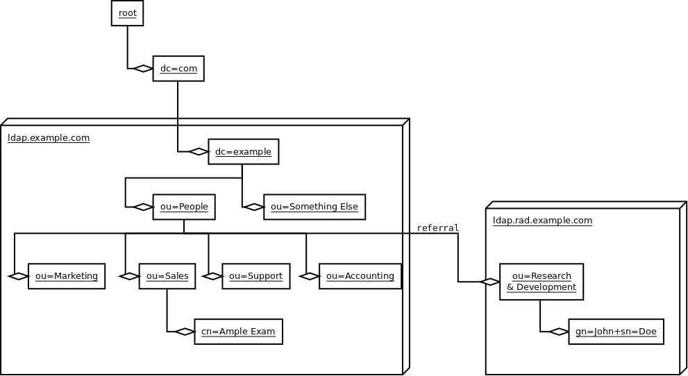

# LDAP

## What is LDAP

https://www.redhat.com/it/topics/security/what-is-ldap-authentication

https://medium.com/@nisha.narayanan/securing-your-api-connect-cloud-with-ldap-e214f6886d29
https://ldaptor.readthedocs.io/en/latest/ldap-intro.html

https://docs.digital.ai/bundle/devops-deploy-version-v.22.2/page/deploy/how-to/setup-and-configuration-LDAP-with-deploy.html

LDAP stands for Lightweight Directory Access Protocol. 
It is an industry standard application protocol (RFC [here](https://tools.ietf.org/html/rfc4511)) that serves to define an interface or language with which client applications can talk to a directory service (such as OpenLDAP, Active Directory etc.) to query or modify the information in the directory.

An **LDAP directory (or server)** typically stores information about _users, user credentials, groups, user memberships_ and so on. Since they act as a central repository for user information, they are commonly used for user authentication and authorization.

You can think of an **LDAP directory** as a _data store that supports client applications to communicate with it using the LDAP protocol_. That said, it is common to hear people using the term LDAP to refer to both the protocol and the directory.

### LDAP goals

LDAP has two main goals: 
* **to store data in the LDAP directory and authenticate users to access the directory**. It also provides the communication language that applications require to send and receive information from directory services. A directory service provides access to where information on organizations, individuals, and other data is located within a network.

* The most common LDAP use case is **providing a central location for accessing and managing directory services**. _LDAP enables organizations to store, manage, and secure information about the organization, its users, and assets–like usernames and passwords_. This helps simplify storage access by providing a hierarchical structure of information, and it can be critical for corporations as they grow and acquire more user data and assets.

* LDAP also functions as an **identity and access management (IAM)** solution that targets _user authentication_, including support for Kerberos and single sign-on (SSO), _Simple Authentication Security Layer_ (SASL), and _Secure Sockets Layer_ (SSL).

### LDAP directory structure DIT

An **LDAP directory** has a hierarchical _tree-like structure and consists of one or more entries_.
It is called **DIT** (_Directory Information Tree_).
A typical DIT has the following structure of different type of **entries**
* _main directory_ (**dc**)
*  _organization name_ (**o**) or the _country_ (**c**)
* _organizational unit_ (**ou**)
* _common names_ (**cn**):  is used to identify the name of a group or individual user account 
  (ex. `cn=developers, cn=Susan`). A user can belong to a group, so if Susan is a developer, they could also live under cn=developers.


The entries generally represent real world entities such as organizations, users and so on. 
For an enterprise, for example, the top or **root of the tree** could represent the _organization itself_. 
This can be followed by **child entries** that can be used to _represent organizational or business units_, say, by location or function. 
These can further support more entries representing _individual resources like users, groups etc_. like shown in the figure below.



### Names
* **Distinguished name (DN)**: contains a path through the directory information tree (DIT) for LDAP identify a specific entry (ex. `cn=Ample Exam, ou=Sales, ou=People, dc=example, dc=com`)
* **Relative Distinguished Name (RDN)**: each component in the path within the DN (ex. `cn=Ample Exam`)

### Attributes
Each entry typically has one or more attributes that are used to describe the object 
(such as first name, last name, email, business unit etc.). These are modeled as name/value pairs.
The LDAP specification defines a standard set of attributes (eg: _cn, sn, mail, objectClass_ etc.)

```
dn: cn=triddle,ou=users,dc=hogwarts,dc=com
objectClass: organizationalPerson
objectClass: person
objectClass: inetOrgPerson
objectClass: top
cn: triddle
sn: Riddle
displayName: Tom Riddle
givenName: Tom
mail: Tom.Riddle@hogwarts.edu
uid: 20007
userPassword: SHA hashed password
```

## User authentication using LDAP

To successfully authenticate a user against an LDAP server, you are required to do, what in LDAP terms is called a _bind_. 
This is simply the process of authentication and expects a username and password. 
The **username in this case will be the DN of the LDAP entry**.

```
username: cn=triddle,ou=users,dc=hogwarts,dc=com
password: <userPassword_attribute>
```

## Run OpenLDAP with Docker
Start an OpenLDAP container.

we can use the [docker-compose.yaml](docker-compose.yaml) file.

Once started we can login to http://localhost:8080 

using the user: `dc=my-org,dc=com`
and password: `<LDAP_ADMIN_PASSWORD>`


https://medium.com/@im_gpd/ldap-and-jwt-authentication-in-spring-boot-a-comprehensive-guide-a0e6202655f

https://www.tutorialspoint.com/how-to-implement-simple-authentication-in-spring-boot