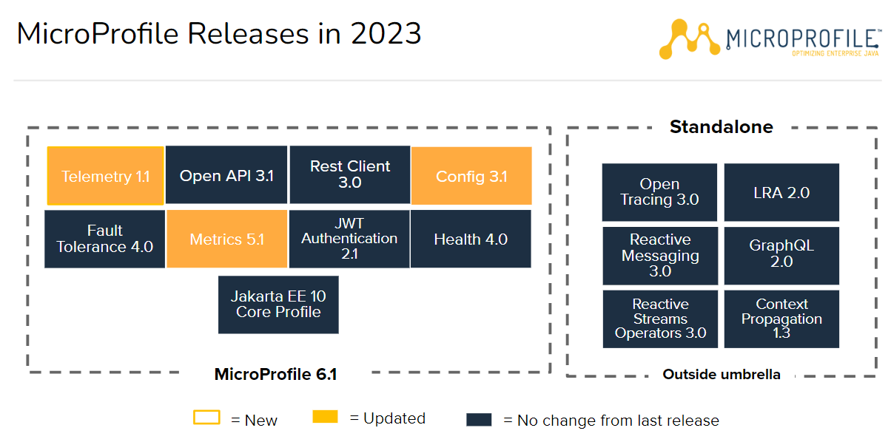

# Quarkus introduction

## Microprofile

A **microservices architecture** can be almost anything that incorporates the
coordination of services into a cohesive application that meets business requirements.
Architects and developers can benefit tremendously from having patterns and recommendations for how they can be designed.
This is where **microservices design pattern** come to the aid of enterprise Java developers.

**Java EE** has been traditionally focused on three-tier monolithic architecture with a steady, measured evolution and a strong focus on backward compatibility. Java EE stopped evolving between 2014 and 2017, just as the industry began to heavily adopt microservices. During that pause, many microservices APIs were born. The risk of API fragmentation across Java runtimes that had been known for application portability increased. In addition, there was a risk of losing reusable skills. For example, **Java EE APIs like JPA and JAX-RS are used with non-Java EE platforms like Spring and Dropwizard**, making it easier to switch to a Java runtime that better meets business criteria. To avoid fragmentation and loss of reusable skills, the community decided to collaborate on microservice specifications.

To avoid Java API fragmentation, **IBM, London Java Community (LJC), Payara, Red Hat, and Tomitribe** founded **MicroProfile** in June 2016.
**MicroProfile** extends that foundation through the **creation and evolution of Java API specifications** for well-understood microservices patterns and cloud-related standards. These common APIs can be used by multiple frameworks and implementations or runtimes.

### Microprofile 6.1 API specifications

* **Config 3.1**: Provides an easy to use and flexible system for application configuration
* **Fault tolerance 4.0**: Defines multiple strategies to improve application robustness
* **Health 4.0**: Expose the availability of a MicroProfile runtime to underlying platform
* **JWT Authentication 2.1**: Using OpenID Connect(OIDC) based JSON Web Tokens(JWT) for role based access control(RBAC) of microservice endpoints.
* **Metrics 5.1**: Define custom application metrics and expose platform metrics on a standard endpoint using standard formats
* **Telemetry 1.1**: Trace request flows between service boundaries
* **OpenApi 3.1**: Provides Java interfaces and programming models to natively  produce OpenAPI v3 documents from JAX-RS applications
* **REST Client 3.0**: Type-safe rest client defined as Java interfaces

The **standalone** are considered as extensions of the core specifications of Microprifile

* **Context propagation**: Propagates contexts across units of work that are thread-agnostic
* **GraphQL**: Java API for the GraphQL query language
* **Reactive streams operator**: Allows two different libraries that provide asynchronous streaming to be able to stream data to and from each other
* **Reactive streams messaging**: Provides asynchronous messaging support based on Reactive Streams
* **Open tracing 3.0**: support for distributed tracing via https://opentracing.io/
* **LRA 2.0**: API for loosely coupled services to coordinate long running activities in such a way as to guarantee a globally consistent outcome without the need to take locks on data.

## Quarkus

Quarkus is a **Java microservice runtime** that takes a fresh look at the needs of the modern Java microservice developer. It is designed to be as **productive** as Node.js for developers and **consume as few resources** as Golang. It includes a lot of new, impactful features while supporting the APIs that developers are already familiar with.
 When developing microservices, runtimes often do not consider the target environment. Most runtimes are **deployment-environment agnostic** to be broadly relevant. Although Quarkus is used in a wide variety of deployment environments, it has **specific enhancements and optimizations for Linux containers and Kubernetes**. For this reason, Quarkus is referred to as *Kubernetes-native Java*.

 ### "_Supersonic, Subatomic Java_"

 Quarkus has become known for its fast startup time and low memory usage. Quarkus can run applications on the JVM. It can also compile the application to a native binary using *GraalVM Native Image*.

#### Startup plus time for the first HTTP response
 |          | Traditional Java stack | Quarkus JVM | Quarkus Native |
 | -------- | ---------------------- | ----------- | -------------- |
 | REST app | 4.3                    | .943        | .016           |
 | CRUD app | 9.5                    | 2.03        | 0.42           | 

 #### Memory usage (MB)

 |          | Traditional Java stack | Quarkus JVM | Quarkus Native |
 | -------- | ---------------------- | ----------- | -------------- |
 | REST app | 136                    | 73          | 12             |
 | CRUD app | 209                    | 145         | 28             |

