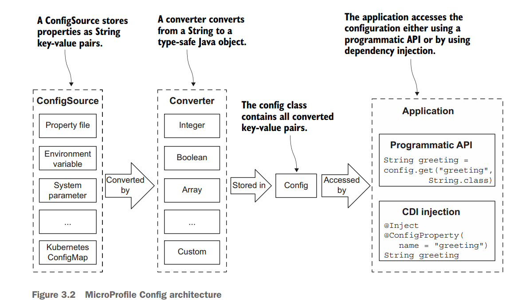
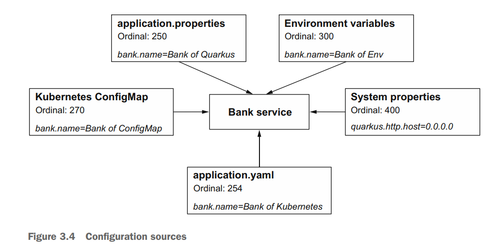
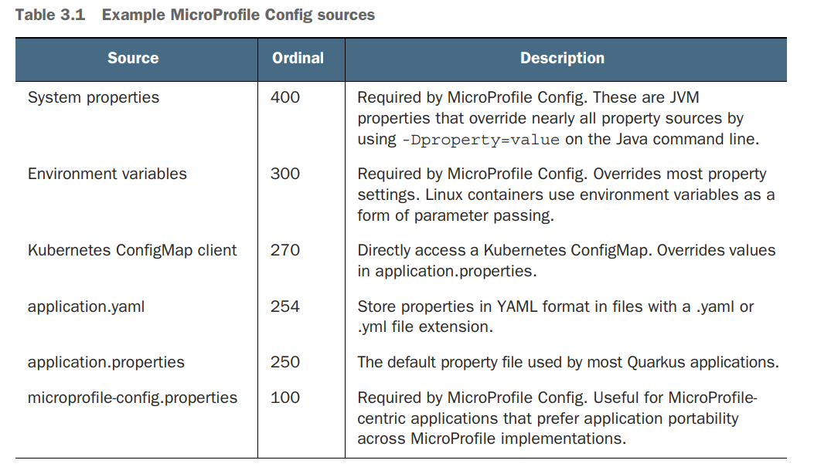
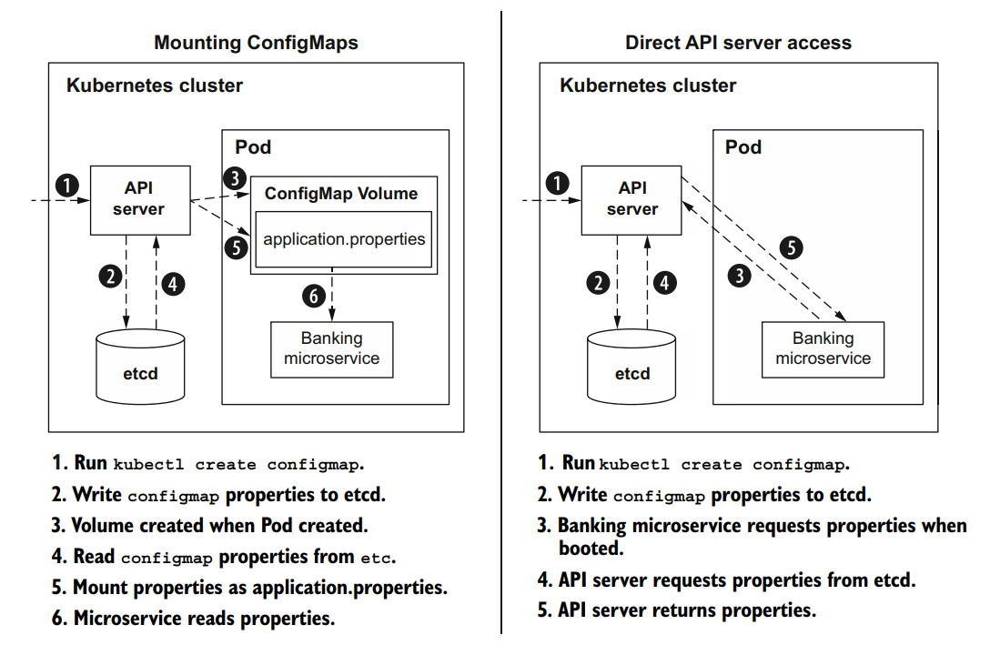

# 03 - Configuring microservices

Code in: https://github.com/apedano/kubernetes-native-microservices-sources/tree/ch03-configuration/bank-service

## ConfigSource and Config class



### `ConfigProperty` example

```java
@ConfigProperty(name="app.mobileBanking") //Injects the value of app.mobileBanking into the mobileBanking field
Optional<Boolean> mobileBanking; //With Optional types, MicroProfile Config will not throw an exception if a property is not defined

@GET
@Produces(MediaType.TEXT_PLAIN)
@Path("/mobilebanking")
public Boolean getMobileBanking() {
 return mobileBanking.orElse(false);
}
```

```java
@GET
@Path("/name-programmatically")
@Produces(MediaType.TEXT_PLAIN)
public String getNameProgrammatically() {
    //Programmatic access to config
    Config config = ConfigProvider.getConfig();
    return config.getValue("bank.name", String.class);
}
```

## Config Sources

Each configuration source is assigned an _ordinal_. The properties defined in a configuration source with a **higher ordinal take precedence** over properties defined in a configuration source with a
lower ordinal





### Enviroment variables name matching rules

For environment variables configuration, Quarkus applies the following rules

1. **Exact match** — Search for `bank.mobileBanking`. If not found, move to the next rule.
2. **Replace each nonalphanumeric with _** — Search for `bank_mobileBanking`. If not found, move to the next rule.
3. **Replace each nonalphanumeric with _ and convert to uppercase** — Search for `BANK_MOBILEBANKING`

Therefore, if we define an env var

`export BANK_NAME="Bank of Env"`

that one will be used because of the higher ordinal compared to the properties file value.

## Grouping properties with Microprofile @ConfigProperties

```java
import org.eclipse.microprofile.config.inject.ConfigProperties;

@ConfigProperties(prefix="bank-support") //makes every field a configuration property
public class BankSupportConfig { //simple POJO
 private String phone;
 public String email; //Fields become properties regardless of access modifiers
 public String getPhone() {
 return phone;
 }
 public void setPhone(String phone) {
 this.phone = phone;
 }
}
```

```properties
#application.properties
#ConfigProperties
bank-support.phone=555-555-555
bank-support.email=${support.email}
```

```java
//Microprofile API
@ConfigProperties(prefix="bank-support")
BankSupportConfig supportConfig;

@GET
@Path("/support")
public HashMap<String, String> getSupport() {
    HashMap<String,String> map = new HashMap<>();
    map.put("email", supportConfig.getEmail());
    map.put("phone", supportConfig.getPhone());
    return map;
}
```

## Quarkus-specific configuration features

### Quarkus configuration profiles

With **profiles**, Quarkus enables us to use multiple configurations **within a single configuration source**. Quarkus defines the following three built-in profiles:

* *dev* — Activated when in developer mode (e.g., mvn quarkus:dev)
* *test* — Activated when running tests
* *prod* — Activated when not in development or test modes. In chapter 4, we use
  profiles to differentiate between production and development database configuration properties.

```properties
# default
bank.name=Bank of Quarkus 
# used for dev profile
%dev.bank.name=Bank of Development 
# used when the application is started with java -jar or when running a natively compiled binary
%prod.bank.name=Bank of Production 
```

### Using a custome profile

We can activate custom profiles by either setting the name of the `quarkus.profile` system property (e.g., `java -Dquarkus.profile=staging -jar myapp.jar`) or by setting the `QUARKUS_PROFILE` environment variable

So we can use properties like:

```properties
%staging.bank.name=Bank of Staging
```

### Property expressions

```properties
support.email=email@bank.com
bank-support.phone=555-555-555
bank-support.email=${support.email}
```

### `@ConfigMapping`

Quarkus offers a custom API, **@ConfigMapping**, that groups properties together like MicroProfile `@ConfigProperties` but is more flexible and feature-rich.
It supports nested config within the same class

```java
import io.smallrye.config.ConfigMapping;

@ConfigMapping(prefix = "bank-support-mapping")
public interface BankSupportConfigMapping { // config mapping applies to interfaces only
    //Unlike MicroProfile Config @ConfigProperties,
    // @ConfigMapping properties can be validated using
    // Bean Validation constraints.
    @Size(min=12, max=12)
    String phone();

    //Properties are defined as method names
    String email();

    Business business(); //nested properties
    interface Business {
        @Size(min=12, max=12)
        String phone();
        String email();
    }
}
```

```properties
#ConfigMapping
bank-support-mapping.email=support@bankofquarkus.com
bank-support-mapping.phone=555-555-5555
##properties for the nested interface
bank-support-mapping.business.email=business-support@bankofquarkus.com
bank-support-mapping.business.phone=555-555-1234

```

## Run-time vs. build-time properties

In a traditional Java runtime configuration is resolved at runtime, using a **classpath scan** which requires more ram and cpu resources.

Qaurkus optimizes code with **scan at compile time**: all the code and the configuration is created at compile in a **metamodel**, so that memory occupation of the artifact and its boot time will be reduced.
**Build-time properties** influence compilation and how the *metamodel* (like **annotation processing**) is prewired.
Therefore, if we change at runtime a build time configuration value for a Quarkus application, this will not be read by the application because that value has been already precompiled.

This because Quarkus is oriented to containerized runtime (Kubernetes) where pods are supposed to be immutable and ephemeral.

Quarkus accept also **run time configuration for those values that are typically known at run time only**: on example is the **jdbc url**, while the **jdbc driver** is blocked at compile time (it is known what driver we want to use in our application)

Each Quarku extensions comes with the list of compile time and run time configuration: [Configuration property fixed at build time](https://quarkus.io/guides/all-config)

## Configuration on Kubernetes

There are several modes to configure a Quarkus application running on Kubernetes:

* _system properties_: parameters passes to the java run command (``-Djava.util.loggin.manager=...``)
* _environment variable_: since the pod runs a self contained application with the operative system, it is possible to set environment variables active only for the running application (``POSTGRES_USER``)
* _ConfigMaps_:
  The common approach to attach a _ConfigMap_ to an application is to mount it as a volume accessible to all containers in the pod (in Tekton as key=filename, value=filecontent)
  The Quarkus extension uses the approach of **directly accessing** the configuration in the _etcd_ database using the Kuberneted API.
  
* _application.properties_: this can still be used in the containerized Quarkus application
* _third party configuration sources_: supported are Spring Cloud Config Server, Vault, and Consul

## Add ConfigMap support for Quarkus

```xml
<dependency>
    <groupId>io.quarkus</groupId>
    <artifactId>quarkus-kubernetes-config</artifactId>
</dependency>
```

A _ConfigMap_ with name **banking** can be generated with in the cluster with:


```shell
kubectl create configmap account-service-cm --from-file=application.yaml
```

It will contain the key _application.yaml_ which will have priority over the ones on application.properties

```yaml
bank:
  name: Bank of ConfigMap
```


Now the ``application.properties`` files has to be changed with

````properties
%prod.quarkus.kubernetes-config.enabled=true
#comma separated list of cm names to be scanned
%prod.quarkus.kubernetes-config.config-maps=banking
````

## Add Secret support for Quarkus

Create a secret

```shell
kubectl create secret generic db-credentials --from-literal=username=admin --from-literal=password=secret --from-literal=db.username=quarkus_banking --from-literal=db.password=quarkus_banking 
```

Add properties for secrets in ``application.properties`` (note the name of the secret)

```properties
%prod.quarkus.kubernetes-config.secrets.enabled=true
%prod.quarkus.kubernetes-config.secrets=db-credentials
```

## Deploy to Openshift

Once deployed with the mvn goal described in [02-Your first Quarkus application](02-Your first Quarkus application.md)

```bash
$ curl -s http://bank-service-xan80-dev.apps.sandbox-m4.g2pi.p1.openshiftapps.com/bank/name

Bank of ConfigMap
```
