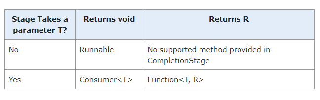

## 05 - APP 01 - Asynchronous response types

On the transaction service

https://www.logicbig.com/tutorials/core-java-tutorial/java-multi-threading/completion-stage-and-completable-future.html

https://www.baeldung.com/java-completablefuture#:~:text=The%20CompletableFuture.join()%20method,the%20Stream.map()%20method.

Java 8 introduced the `CompletableFuture` class. Along with the `Future` interface, it also implemented the `CompletionStage` interface. This interface defines the **contract for an asynchronous computation step that we can combine with other steps**.

CompletableFuture is at the same time, a building block and a framework, with about 50 different methods for composing, combining, and executing asynchronous computation steps and handling errors.

### `CompletionStages` interface

All method class implementing this **interface** (e.g. `CompletableFuture` class) **return an instance of** `CompletionStage` itself, which allows **chaining multiple async tasks**.

## `CompletableFuture` class

Implements the `CompletionStages` interface. Applies to **void and not void** methods

### Use `CompletableFuture` as a Simple `Future`

First, the `CompletableFuture` class implements the `Future` interface so that we can use it as a **Future implementation but with additional completion logic**.

For example, we can create an instance of this class with a no-arg constructor to represent some future result, hand it out to the consumers, and complete it at some time in the future using the complete method. The consumers may use the get method to block the current thread until this result is provided.

In the example below, we have a method that creates a CompletableFuture instance, then spins off some computation in another thread and returns the Future immediately.

When the computation is done, the method completes the `Future` by providing the result to the complete method:

```java
public Future<String> calculateAsync() throws InterruptedException {
    CompletableFuture<String> completableFuture = new CompletableFuture<>();

    Executors.newCachedThreadPool().submit(() -> {
        Thread.sleep(500);
        completableFuture.complete("Hello");
        return null;
    });

    return completableFuture;
}

Future<String> completableFuture = calculateAsync();

// ... 

String result = completableFuture.get(); //when we are ready to get the result from the Future
assertEquals("Hello", result);
```

#### `CompletableFuture` implementation of `CompletionStage` for void methods

Two methods can ben used

```java
public static CompletableFuture<Void> runAsync(Runnable runnable)
public static CompletableFuture<Void> runAsync(Runnable runnable, Executor executor)
```

Example

```java
package com.logicbig.example;

import java.util.concurrent.CompletableFuture;

public class RunExample {
  public static void main(String[] args) {
      CompletableFuture<Void> cf =
              CompletableFuture.runAsync(() -> {
                  System.out.println("running, in thread: " + Thread.currentThread().getName());
              });
      cf.join();//waits until task is completed
      System.out.println("main exiting, thread: "+Thread.currentThread().getName());
  }
}
```

```shell
running, in thread: ForkJoinPool.commonPool-worker-3
main exiting, thread: main
```

### `CompletableFuture.join()` vs `Future.get()`

```java
public T join()
public T get() throws InterruptedException, ExecutionException
```

These methods implement two different interfaces, but they both wait and return the result value when completed.

### Chaining _CompletionStage_(s) with _runAsync()_

```java
CompletionStage<Void> thenRun(Runnable action)
CompletionStage<Void> thenRunAsync(Runnable action)
CompletionStage<Void> thenRunAsync(Runnable action, Executor executor)
```

Example

```java
package com.logicbig.example;

import java.time.LocalTime;
import java.util.concurrent.CompletableFuture;
import java.util.concurrent.CompletionStage;

public class RunExample2 {
  public static void main(String[] args) {
      CompletionStage<Void> cf =
              CompletableFuture.runAsync(() -> performTask("first stage"));
      cf = cf.thenRun(() -> performTask("second stage"));
      cf = cf.thenRunAsync(() -> performTask("third stage"));
      ((CompletableFuture) cf).join();//waits until task is completed
      System.out.println("main exiting");
  }

  private static void performTask(String stage) {
      System.out.println("---------");
      System.out.printf("stage: %s, time before task: %s, thread: %s%n",
              stage, LocalTime.now(), Thread.currentThread().getName());
      try {
          //simulating long task
          Thread.sleep(1000);
      } catch (InterruptedException e) {
          e.printStackTrace();
      }
      System.out.printf("stage: %s, time after task: %s, thread: %s%n",
              stage, LocalTime.now(), Thread.currentThread().getName());
  }
}
```

Output

```shell
---------
stage: first stage, time before task: 17:39:13.018213700, thread: ForkJoinPool.commonPool-worker-3
stage: first stage, time after task: 17:39:14.026771300, thread: ForkJoinPool.commonPool-worker-3
---------
stage: second stage, time before task: 17:39:14.026771300, thread: ForkJoinPool.commonPool-worker-3
stage: second stage, time after task: 17:39:15.027458600, thread: ForkJoinPool.commonPool-worker-3
---------
stage: third stage, time before task: 17:39:15.030441900, thread: ForkJoinPool.commonPool-worker-3
stage: third stage, time after task: 17:39:16.031504, thread: ForkJoinPool.commonPool-worker-3
main exiting
```

In above example the two async tasks ran in the same thread (created by the default executor) i.e. `ForkJoinPool.commonPool-worker-3`.

**Note**:

* `CompletableFuture`, by default, uses an `Executor` created by `ForkJoinPool.commonPool()` (unless parallelism is not supported, in which case, a new Thread is created to run each task).
* For a **non-async stage**, the task is executed in the thread that completes the previous stage.

### Run with a non default _Executor_

As said the default exeutor is `ForkJoinPool.commonPool()`.
We can also run a `CompletableFuture` with a provided executor

```java
ublic class RunExample3 {
  public static void main(String[] args) {
      ExecutorService executor = Executors.newFixedThreadPool(3);

      CompletableFuture.runAsync(() -> performTask("first stage"), executor)
                       .thenRun(() -> performTask("second stage"))
                       .thenRunAsync(() -> performTask("third stage"), executor)
                       .join();//waits until task is completed
      System.out.println("main exiting");
      executor.shutdown();
  }

  private static void performTask(String stage) {
      System.out.println("---------");
      System.out.printf("stage: %s, time before task: %s, thread: %s%n",
              stage, LocalTime.now(), Thread.currentThread().getName());
      try {
          //simulating long task
          Thread.sleep(1000);
      } catch (InterruptedException e) {
          e.printStackTrace();
      }
      System.out.printf("stage: %s, time after task: %s, thread: %s%n",
              stage, LocalTime.now(), Thread.currentThread().getName());
  }
}
```

Output

```shell
---------
stage: first stage, time before task: 15:48:58.797553100, thread: pool-1-thread-1
stage: first stage, time after task: 15:48:59.809014600, thread: pool-1-thread-1
---------
stage: second stage, time before task: 15:48:59.810009, thread: pool-1-thread-1
stage: second stage, time after task: 15:49:00.811988700, thread: pool-1-thread-1
---------
stage: third stage, time before task: 15:49:00.813970800, thread: pool-1-thread-2
stage: third stage, time after task: 15:49:01.814515500, thread: pool-1-thread-2
main exiting
```

## Creating and Running tasks that return results

```java
public static <U> CompletableFuture<U> supplyAsync(Supplier<U> supplier)
public static <U> CompletableFuture<U> supplyAsync(Supplier<U> supplier, Executor executor)
```

Example

```java
public class SupplyExample {
  public static void main(String[] args) {
      CompletableFuture<Integer> cf =
              CompletableFuture.supplyAsync(() -> ThreadLocalRandom.current().nextInt(1, 10));
      Integer integer = cf.join();//similar to cf.get()
      System.out.println(integer);
  }
}
```

### Chaining CompletionStage(s) with supplyAsync()

Since `CompletableFuture.supplyAsync()` returns `CompletableFuture<T>`, only those methods defined in CompletionStage can be chained which require a function with argument of type T and optionally produce a result (of any type) :

```java
<U> CompletionStage<U> thenApply(Function<? super T, ? extends U> fn)
<U> CompletionStage<U> thenApplyAsync(Function<? super T,? extends U> fn)
<U> CompletionStage<U> thenApplyAsync(Function<? super T,? extends U> fn, Executor executor)
CompletionStage<Void> thenAccept(Consumer<? super T> action)
CompletionStage<Void> thenAcceptAsync(Consumer<? super T> action)
CompletionStage<Void> thenAcceptAsync(Consumer<? super T> action, Executor executor)
```

Example which reads the content of a web page:

```java
package com.logicbig.example;

import java.io.InputStream;
import java.net.URL;
import java.util.concurrent.CompletableFuture;
import java.util.concurrent.ThreadLocalRandom;

public class SupplyExample4 {
    public static void main(String[] args) {
        CompletableFuture.supplyAsync(() -> {
                    try {
                        URL url = new URL("https://www.example.com/");
                        try (InputStream is = url.openStream()) {
                            return new String(is.readAllBytes());
                        }
                    } catch (Exception e) {
                        throw new RuntimeException(e);
                    }
                }).thenAccept(System.out::println)
                .thenRun(() -> System.out.println("Task finished"))
                .join();
    }
}

```

There's very simple rule for chaining here:

The methods which return `CompletionStage<Void>` or `CompletableFuture<Void>` can only be chained with a method which takes a `Runnable` or `Supplier`.
The methods which return `CompletionStage<U>` can be chained with methods which takes `Consumer<U>` or `Function<U,R>`.

The intermediate completion stages can be summarized as:



### Executing multuple tasks in parallel and get results stream

```java
@Test
void bulkheadTest() {
    ExecutorService executor = Executors.newFixedThreadPool(3);
    List<CompletableFuture<Response>> completableFutures = List.of(
        CompletableFuture.supplyAsync(responseSupplier(1), executor),
        CompletableFuture.supplyAsync(responseSupplier(2), executor),
        CompletableFuture.supplyAsync(responseSupplier(3), executor)
    );
    List<Response> list = completableFutures.stream().map(CompletableFuture::join).toList();
    log.info("All futures joined");
    assertThat(list)
        .isNotEmpty()
        .hasSize(3)
        .map(response -> Status.fromStatusCode(response.getStatusCode()))
        .containsExactlyInAnyOrder(Status.OK, Status.OK, Status.TOO_MANY_REQUESTS);
}

private Supplier<Response> responseSupplier(int counter) {
    return () -> {
        log.info("Executing call #{} on thread [{}]", counter, Thread.currentThread().getName());
        return given()
            .contentType("application/json")
            .when()
            .get("resilience/do-delivery-bulkhead")
            .then()
            .extract()
            .response();
    };
}
```
Log contents
```bash
2023-11-20 13:23:10,426 INFO  [org.acm.res.ResilienceStrategiesResourceTest] (pool-8-thread-1) Executing call #1 on thread [pool-8-thread-1]
2023-11-20 13:23:10,426 INFO  [org.acm.res.ResilienceStrategiesResourceTest] (pool-8-thread-3) Executing call #3 on thread [pool-8-thread-3]
2023-11-20 13:23:10,426 INFO  [org.acm.res.ResilienceStrategiesResourceTest] (pool-8-thread-2) Executing call #2 on thread [pool-8-thread-2]
2023-11-20 13:23:11,072 INFO  [org.acm.res.ResilienceStrategiesResource] (executor-thread-2) Falling back to ResilienceStrategiesResource#bulkheadFallback()
2023-11-20 13:23:11,072 INFO  [org.acm.res.ResilienceStrategiesResource] (executor-thread-1) Called doDelivery...
2023-11-20 13:23:11,072 INFO  [org.acm.res.ResilienceStrategiesResource] (executor-thread-3) Called doDelivery...
2023-11-20 13:23:11,072 INFO  [org.acm.res.ResilienceStrategiesResource] (executor-thread-1) Using driver #2
2023-11-20 13:23:11,072 INFO  [org.acm.res.ResilienceStrategiesResource] (executor-thread-3) Using driver #1
2023-11-20 13:23:14,082 INFO  [org.acm.res.ResilienceStrategiesResource] (executor-thread-3) Delivery #1 executed. #1 drivers available
2023-11-20 13:23:14,082 INFO  [org.acm.res.ResilienceStrategiesResource] (executor-thread-1) Delivery #2 executed. #2 drivers available
2023-11-20 13:23:14,092 INFO  [org.acm.res.ResilienceStrategiesResourceTest] (main) All futures joined
```
