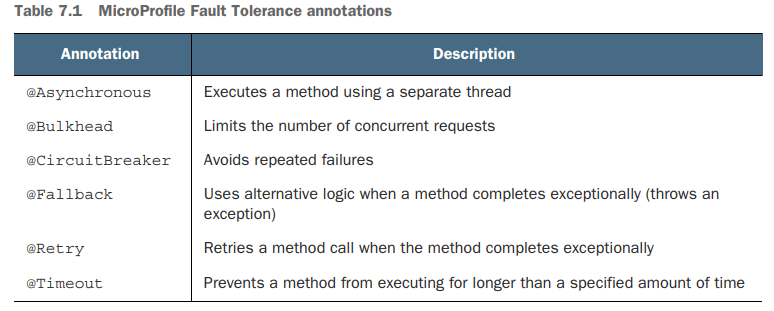
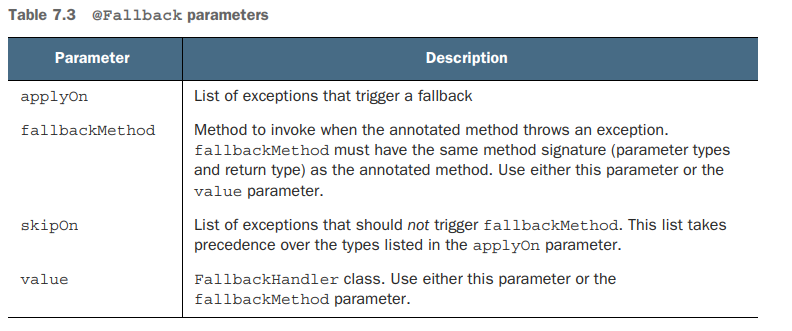
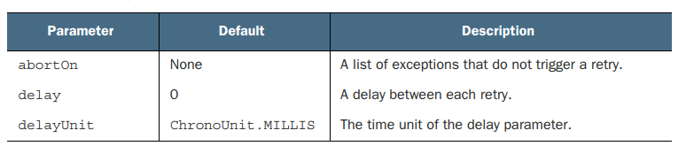
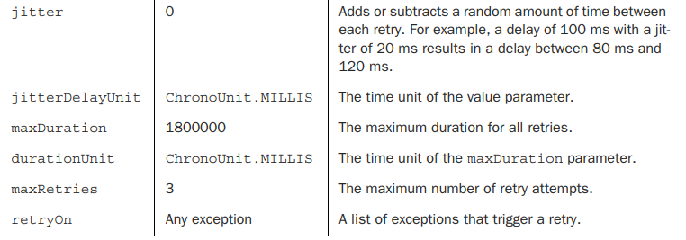
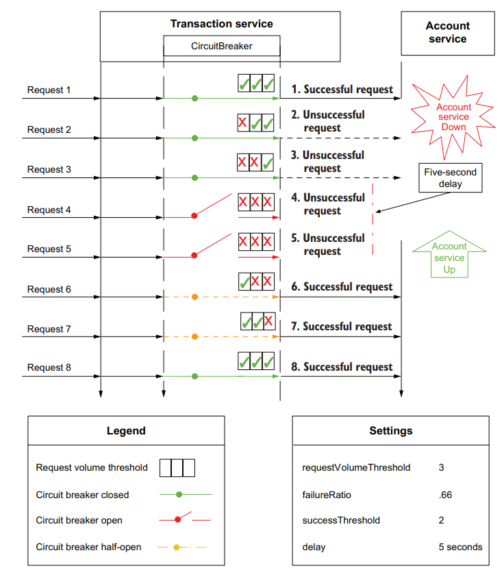
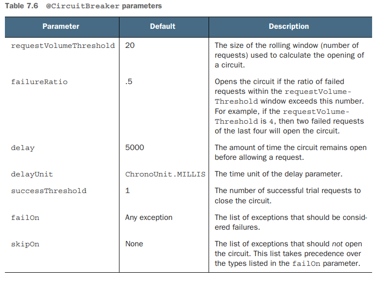

# 07 - Resilience strategies

Code: https://github.com/apedano/kubernetes-native-microservices-sources/tree/ch-07-resilience

Extension

```xml

<dependency>
    <groupId>io.quarkus</groupId>
    <artifactId>quarkus-smallrye-fault-tolerance</artifactId>
</dependency>
```




## Using _@Asynchronous_

Instead of blocking a worker thread by waiting for a response, the `@Asynchronous` annotation uses a separate thread to invoke the remote service to increase concurrency and throughput. See the next code listing for an example.

This book does not advocate using the `@Asynchronous` annotation with Quarkus and
will not cover the annotation in detail. The `@Asynchronous` annotation is for **runtimes that make heavy use of threads and thread pools to achieve higher concurrency and throughput**, like Jakarta EE runtimes. Quarkus uses a nonblocking network stack and event loop execution model based on **Netty and Eclipse Vert.x**. It can achieve higher concurrency and throughput using its inherent asynchronous and reactive APIs while using less RAM and CPU overhead.
For example, the Quarkus RESTEasy Reactive extension enables the use of JAX-RS
annotations and handles requests directly on the IO thread. Developers can use the
APIs they already know while benefiting from the throughput typically reserved for
asynchronous runtimes like Vert.x.

## Constraining concurrency with bulkheads (paratie)

The **bulkhead** concept comes from shipbuilding, which constrains a compromised section of a ship’s hull by **closing bulkhead doors to isolate the incoming water**.
The **bulkhead architectural pattern** applies this concept to *prevent a failure in one service from cascading to another
service* by limiting the number of concurrent method invocations.
For instance, in case of calls to time-consuming external services might cost to exhaust the worker thread pool (specially if applications like Jakarta EE and Spring use one worker thread per request)

MicroProfile Fault Tolerance specifies bulkheads using the `@Bulkhead` annotation, which can be applied to either **a method or a class**. See the next listing for an example.

```java
//
@Bulkhead(10)
public String invokeLegacySystem(){
        ...
        }
```


The @Bulkhead annotation can be used together with _@Asynchronous_, _@CircuitBreaker_, _@Fallback_, _@Retry_, and _@Timeout_

The values uses a semaphore based on the number of unanswered concurrent request


## Exception handling with _@Fallback_



```java
 @GET
@Path("/do-delivery-bulkhead")
@Bulkhead(value = 2) //the value of allowed concurrent calls of this method
@Fallback(fallbackMethod = "bulkheadFallback", //Method name of the fallback impl with the same signature as the resource method
        applyOn = {BulkheadException.class})
public Response doDelivery() throws InterruptedException {
    log.info("Called doDelivery...");
    //if the bulkhead value is the same as the number of
    //available drivers this condition will never be true
    if (availableDrivers.get() == 0) {
        log.info("No drivers available. Calling fallback");
        throw new BulkheadException("No drivers available");
    }
    log.info("Using driver #{}", availableDrivers.getAndDecrement());
    sleep(3000);

    log.info("Delivery #{} executed. #{} drivers available",
            deliveriesDone.incrementAndGet(),
            availableDrivers.incrementAndGet());
    return Response.ok().entity(deliveriesDone.get()).build();
}
```

```java
@Test
void bulkheadTest() {
    ExecutorService executor = Executors.newFixedThreadPool(3);
    List<CompletableFuture<Response>> completableFutures = List.of(
            CompletableFuture.supplyAsync(responseSupplier(1), executor),
            CompletableFuture.supplyAsync(responseSupplier(2), executor),
            CompletableFuture.supplyAsync(responseSupplier(3), executor)
    );
    List<Response> list = completableFutures.stream().map(CompletableFuture::join).toList();
    log.info("All futures joined");
    assertThat(list)
            .isNotEmpty()
            .hasSize(3)
            .map(response -> Status.fromStatusCode(response.getStatusCode()))
            .containsExactlyInAnyOrder(Status.OK, Status.OK, Status.TOO_MANY_REQUESTS);
}

private Supplier<Response> responseSupplier(int counter) {
    return () -> {
        log.info("Executing call #{} on thread [{}]", counter, Thread.currentThread().getName());
        return given()
                .contentType("application/json")
                .when()
                .get("resilience/do-delivery-bulkhead")
                .then()
                .extract()
                .response();
    };
}
```

## Executions _@Timeout_

```java
@GET
@Path("/call-with-timeout")
@Timeout(100) //need to complete in less than 100 ms or a TimeoutException will be thrown
@Fallback(fallbackMethod = "timeoutFallback") //if any exception is thrown
@Produces(MediaType.APPLICATION_JSON)
public Response getTimeout() throws InterruptedException {
    Thread.sleep(200);
    return Response.ok().build();
}
public Response timeoutFallback() {
    return Response.status(Response.Status.GATEWAY_TIMEOUT).build();
}
```

```java
@Test
void timeoutTest() {
    given()
        .contentType("application/json")
        .when()
        .get("resilience/call-with-timeout")
        .then()
        .statusCode(GATEWAY_TIMEOUT.getStatusCode());
}
```

## Recovering from temporary failure with _@Retry_

The `@Retry` annotation retries method invocations a configurable number of
times if the method completes exceptionally. It is a **failure recovery strategy**





```java
@GET
@Path("/call-retry")
@Timeout(100)
@Retry(delay = 100, //delay between reties
        jitter = 25, //variance of time between reties (85 - 125)
        maxRetries = 3,
        retryOn = TimeoutException.class) //other exceptions will be handled normally
@Fallback(fallbackMethod = "timeoutFallback")
public Response getRetry() {
    //the service method will delay the return to trigger the timeout for 2 times. The third call from the same thread name will not trigger timeout
    return Response.ok().entity(serviceForRetry.doesNotDelayAfterRepeatedCalls()).build();
}
```

```java
@Test
void retryTest() {
    //the first two timeouts triggered by the service are transparent, the response
    //will be delayed until the number of retries is completed (in that case the Timeout exception will be thrown)
    //or service call is successful
    given()
        .contentType("application/json")
        .when()
        .get("resilience/call-retry")
        .then()
        .statusCode(OK.getStatusCode());
}
```

```bash
2023-11-20 15:16:50,320 INFO  [org.acm.ser.ServiceForRetry] (executor-thread-1) Call #0 for thread executor-thread-1
2023-11-20 15:16:50,320 INFO  [org.acm.ser.ServiceForRetry] (executor-thread-1) Applying delay
2023-11-20 15:16:50,520 INFO  [org.acm.ser.ServiceForRetry] (executor-thread-1) Call #1 for thread executor-thread-1
2023-11-20 15:16:50,520 INFO  [org.acm.ser.ServiceForRetry] (executor-thread-1) Applying delay
2023-11-20 15:16:50,738 INFO  [org.acm.ser.ServiceForRetry] (executor-thread-1) Call #2 for thread executor-thread-1
2023-11-20 15:16:50,738 INFO  [org.acm.ser.ServiceForRetry] (executor-thread-1) Resetting the count, not applying delay
```


## Avoiding repeated failure with circuit breakers

A circuit breaker **avoids operations that are likely to fail**.
It is a resilience pattern popularized by the _Netflix Hystrix framework_ and is also the most complex resilience pattern to understand.

A circuit breaker consists of the following three steps:

1. **Detect repeated failure**, typically of expensive operations like a remote service invocation.
2. **“Fail fast”** by immediately throwing an exception instead of conducting an expensive operation.
3. **Attempt to recover** by occasionally allowing the expensive operation. If successful, resume normal operations.

### How a circuit breaker works



The circuit breaker logic holds a rolling window of the last _**requestVolumeThreshold**_ size.
If the _**failureRatio**_ percentage of the window size is reached (*Request 4*), then the circuit breaker opens;
this means that the next call (*Request 5*) will be delayed of _**delay**_ time. When the first succesfull call happens,
the breaker is half open until the _**successThreshold**_ is reached.



```java
@GET
@Path("/call-circuit-breaker")
@Bulkhead(1)
@CircuitBreaker(
        requestVolumeThreshold=3,
        failureRatio=.66,
        delay = 3,
        delayUnit = ChronoUnit.SECONDS,
        successThreshold=2
)
@Fallback(value = TransactionServiceFallbackHandler.class) //handler class to support multiple type of exceptions
public Response callCircuitBreakerService() {
    return Response.ok().entity(circuitBreakerBackendService.callService()).build();
}
```

This can be tested with repeated calls as results in the `ResilienceStrategiesResourceTest::circuitBreakerTest` -> [file](https://github.com/apedano/kubernetes-native-microservices-sources/blob/f3d7cca2660942a880c40324a8f3d966aa41c131/account-service/src/test/java/org/acme/resource/ResilienceStrategiesResourceTest.java#L82C13-L82C13)

The first call is successful
```
2023-11-22 09:59:42,167 INFO  [org.acm.ser.CircuitBreakerBackendService] (executor-thread-1) Called CircuitBreakerBackendService at Wed Nov 22 09:59:42 CET 2023 returning SUCCESS
```
The following two calls result in a `FAILURE` (code `500`) so the `requestVolumeThreshold=3` and the `successThreshold=2` open the circuit 

```
2023-11-22 09:59:43,221 INFO  [org.acm.res.ResilienceStrategiesResourceTest] (main) Checking circuit breaker non ok #1
2023-11-22 09:59:43,230 INFO  [org.acm.ser.CircuitBreakerBackendService] (executor-thread-1) Called CircuitBreakerBackendService at Wed Nov 22 09:59:43 CET 2023 returning FAILURE
2023-11-22 09:59:43,233 INFO  [org.acm.res.ResilienceStrategiesResourceTest] (main) Checking open circuit breaker response 500
2023-11-22 09:59:44,246 INFO  [org.acm.res.ResilienceStrategiesResourceTest] (main) Checking circuit breaker non ok #2
2023-11-22 09:59:44,254 INFO  [org.acm.ser.CircuitBreakerBackendService] (executor-thread-1) Called CircuitBreakerBackendService at Wed Nov 22 09:59:44 CET 2023 returning FAILURE
2023-11-22 09:59:44,262 INFO  [org.acm.res.ResilienceStrategiesResourceTest] (main) Checking open circuit breaker response 500
```
For the `delay = 3` period the circuit is open (`CircuitBreakerOpenException`)
```
2023-11-22 09:59:45,276 INFO  [org.acm.res.ResilienceStrategiesResourceTest] 
(main) Checking circuit breaker non ok #3
2023-11-22 09:59:45,284 INFO  [org.acm.res.TransactionServiceFallbackHandler] (executor-thread-1) ******** callCircuitBreakerService: CircuitBreakerOpenException ********
2023-11-22 09:59:45,285 INFO  [org.acm.res.ResilienceStrategiesResourceTest] (main) Checking open circuit breaker response 503
2023-11-22 09:59:46,288 INFO  [org.acm.res.ResilienceStrategiesResourceTest] (main) Checking circuit breaker non ok #4
2023-11-22 09:59:46,295 INFO  [org.acm.res.TransactionServiceFallbackHandler] (executor-thread-1) ******** callCircuitBreakerService: CircuitBreakerOpenException ********
2023-11-22 09:59:46,297 INFO  [org.acm.res.ResilienceStrategiesResourceTest] (main) Checking open circuit breaker response 503

```

The first call after the open circuit delay is a `SUCCESS`
```
2023-11-22 09:59:47,304 INFO  [org.acm.res.ResilienceStrategiesResourceTest] (main) Checking circuit breaker non ok #5
2023-11-22 09:59:47,311 INFO  [org.acm.ser.CircuitBreakerBackendService] (executor-thread-1) Called CircuitBreakerBackendService at Wed Nov 22 09:59:47 CET 2023 returning SUCCESS
2023-11-22 09:59:47,312 INFO  [org.acm.res.ResilienceStrategiesResourceTest] (main) Checking open circuit breaker response 200
```

### Overriding annotation parameter values using properties

MicroProfile Fault Tolerance can globally enable or disable fault tolerance annotations or modify annotation parameters at runtime using properties.
This will allow the developers to disable fault tolerance features in case the production environment uses _**service mesh**_ solutions;
those give the operations team more control and visibility into a microservices deployment, are becoming more common.
A service mesh can shape network traffic and apply its own fault tolerance features to maintain a more reliable Kubernetes cluster. By externalizing fault tolerance annotation parameters using
properties, the operations team can ensure that application @Timeout or @Retry annotations do not conflict with the equivalent service mesh settings.

Four ways to enable/disable fault tolerance annotations using properties follow:

1. `MP_Fault_Tolerance_NonFallback_Enabled=true` Disables all fault tolerance annotations, except for @Fallback annotations.
2. `<annotation>/enabled=false` Disables all fault tolerance annotations of a specific type used within the application.
   For example, `Bulkhead/enabled=false` disables all bulkheads in the application.
3. `<class>/<annotation>/enabled=false` Disables the specified annotation on the specified class. For example, `io.quarkus.transactions.TransactionResource/Timeout/enabled=false` disables all @Timeout annotations defined
   on the TransactionResource class and any of its methods.
4. `<class>/<method>/<annotation>/enabled=false` Disables the specified annotation on a specified method in the specified class. For example,
   `io.quarkus.transactions.TransactionResource/getBalance/Timeout/enabled=false` disables the @Timeout annotation on the TransactionResource.getBalance() method, and all other @Timeout annotations in TransactionResource are unaffected.