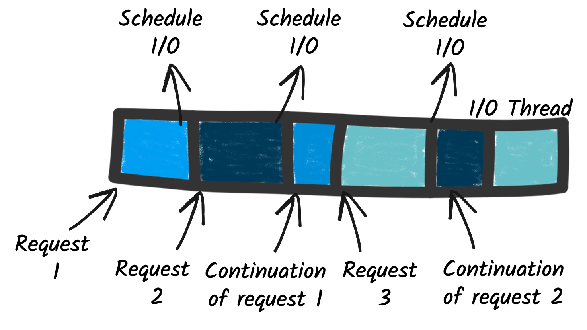

# 08 - Reactive in an imperative world

[Chapter 8 code](https://github.com/apedano/kubernetes-native-microservices-sources/tree/ch-08-reactive-streams-kafka)

https://quarkus.io/guides/quarkus-reactive-architecture

https://www.youtube.com/watch?v=kWlrGtwvOxg

https://quarkus.io/guides/mutiny-primer

## Qaurkus reactive core

**Efficiency** is essential, especially in the Cloud and in containerized environments. Resources, such as CPU and memory, are shared among multiple applications. Greedy applications that consume lots of memory are inefficient and put penalties on sibling applications. You may need to request more memory, CPU, or bigger virtual machines. It either increases your monthly Cloud bill or decreases your deployment density.

### The problem with I/O

I/O is an essential part of almost any modern system. Whether it is to call a remote service, interact with a database, or send messages to a broker, there are all I/O-based operations. Efficiently handling them is critical to avoid greedy applications. For this reason, **Quarkus uses non-blocking I/O**, which allows a *low number of OS threads to manage many concurrent I/Os*. As a result, Quarkus applications allow for higher concurrency, use less memory, and improve the deployment density.

### Reactive architecture

Quarkus uses `Vert.x` and `Netty` at its core to handle the non-blocking I/O interactions. And, it uses a bunch of reactive frameworks and extensions on top to help developers. Quarkus is not just for HTTP microservices, but also for event-driven architecture. Its **reactive nature makes it very efficient when dealing with messages** (e.g., Apache Kafka or AMQP).


Quarkus extensions and the application code can use this engine to orchestrate I/O interactions, interact with databases, send and receive messages, and so on.

What that helps with is a fast non-blocking code that handles almost everything going via the **event-loop thread** (**IO thread**). But, if you were creating a typical REST application or a client-side application, Quarkus also gives you the imperative programming model.

For example, Quarkus HTTP support is based on a non-blocking and reactive engine (Eclipse `Vert.x` and `Netty`). All the HTTP requests your application receive are handled by event loops (**IO Thread**) and then are routed towards the code that manages the request. Depending on the destination, it can invoke the code managing the request on a **worker thread** (servlet, Jax-RS) or use the **IO was thread** (reactive route).
For **messaging connectors**, **non-blocking clients are used and run on top of the Vert.x engine**. So, you can efficiently send, receive, and process messages from various messaging middleware.

## Execution models

While using non-blocking I/O has tremendous benefits, it does not come for free. Indeed, it introduces a new execution model quite different from the one used by classical frameworks.

### Traditional (imperative) execution model

**Traditional applications** use blocking I/O and an imperative (sequential) execution model. So, in an application exposing an HTTP endpoint, **each HTTP request is associated with a thread**. In general, *that thread is going to process the whole request and the thread is tied up serving only that request for the duration of that request*. When the processing requires interacting with a remote service, it uses **blocking I/O**. The thread is blocked, waiting for the result of the I/O. While that model is simple to develop with (as everything is sequential), it has a few drawbacks. To handle concurrent requests, you need multiple threads, so, you **need to introduce a worker thread pool**. The size of this pool constrains the concurrency of the application. In addition, each thread has a cost in terms of memory and CPU. Large thread pools result in greedy applications.


### Reactive execution models

As we have seen above, non-blocking I/O avoids that problem. **A few threads can handle many concurrent I/O**. If we go back to the HTTP endpoint example, the request processing is executed on one of these I/O threads. Because there are only a few of them, you need to use them wisely. **When the request processing needs to call a remote service**, you can’t block the thread anymore. You **schedule the I/O and pass a continuation**, i.e., the code to execute once the I/O completes.



## Reactive Programming Models

First, **Mutiny** is an intuitive, event-driven reactive programming library. With Mutiny, you write event-driven code. Your code is a pipeline receiving events and processing them. Each stage in your pipeline can be seen as a continuation, as Mutiny invokes them when the upstream part of the pipeline emits an event.

The Mutiny API has been tailored to improve the readability and maintenance of the codebase. Mutiny provides everything you need to orchestrate asynchronous actions, including concurrent execution. It also offers a large set of operators to manipulate individual events and streams of events.

## Unification of Imperative and Reactive

Changing your development model is not simple. It requires relearning and restructuring code in a non-blocking fashion. Fortunately, you don’t have to do it!

Quarkus is inherently reactive thanks to its reactive engine. But, you, as an application developer, **don’t have to write reactive code**. Quarkus **unifies reactive and imperative**. It means that you can write traditional blocking applications on Quarkus. But how do you avoid blocking the I/O threads? Quarkus implements a **proactor pattern** that **switches to worker thread when needed**.


Thanks to hints in your code (such as the `@Blocking` and `@NonBlocking` annotations), **Quarkus extensions can decide when the application logic is blocking or non-blocking**. If we go back to the HTTP endpoint example from above, the *HTTP request is always received on an I/O thread*. Then, the extension *dispatching that request to your code decides whether to call it on the I/O thread, avoiding thread switches, or on a worker thread*. This decision **depends on the extension**. For example, the `RESTEasy Reactive extension` uses the `@Blocking` annotation to determine if the method needs to be invoked using a worker thread, or if it can be invoked using the I/O thread.

From the user point of view, the main difference between RESTEasy classic and reactive is how they call the HTTP endpoint methods:

*classic* - always on a worker thread,

*reactive* - on the I/O thread or on a worker thread (and you, as the developer, have the choice)

Using the I/O threads avoids creating additional threads (improving memory consumption) and avoids context switches (improving response time). Emmanuel explained the benefits in the A IO thread and a worker thread walk into a bar: [a microbenchmark story](https://quarkus.io/blog/io-thread-benchmark/) blog post.

As Hibernate ORM *classic* (we also have Hibernate reactive) is blocking, you can’t use it with RESTEasy reactive without using the @Blocking annotation. This annotation changes the dispatching strategy to use a worker thread (instead of the I/O thread). A misusate would result in

```
You have attempted to perform a blocking operation on a IO thread. This is not allowed, as blocking the IO thread will cause major performance issues with your application. ...
```

The following table summarizes the new set of rules:

| Method signature                                  | Dispatching strategy |
| :------------------------------------------------ | :------------------- |
| `T method(…)`                                  | Worker thread        |
| `Uni<T> method(…)`                             | I/O thread           |
| `CompletionStage<T> method(…)`                 | I/O thread           |
| `Multi<T> method(…)`                           | I/O thread           |
| `Publisher<T> method(…)`                       | I/O thread           |
| `@Transactional CompletionStage<T>  method(…)` | Worker thread        |

### The `@NonBlocking` annotation

It is possible to execute a code on I/O thread if the default execution would be for the Worker thread by using the annotation. The example is from a RESTEasy classic (blocking) code

```java
@Path("/hello")
public class GreetingResource {

   @GET
   @NonBlocking
   public String hello() {
       return "Hello";
   }
}
```

### The `@Blocking` annotation

Developers need the ability to indicate which code is blocking, allowing the framework to offload the blocking code into a separate thread. Quarkus enables this with the `@Blocking` annotation for reactive messaging, as shown next.

```java
@Incoming("new-order") //Subscriber to the new-order channel
@Blocking //The method executes blocking code and runs the method on a thread that is switched to a worker thread (Blocking event handler)
@Transactional  
public void handleNewOrder(NewOrder newOrder) {
    log.info("Processing received new order: {}", newOrder);
    Order order = createNewOrder(newOrder);
    orderUpdatesEmitter.send(toDto(order));
    orderRepository.persist(order); //this is the operation that needs to be exectued on the worker thread

}
```

`@Blocking` is a great annotation because it **enables developers to utilize Reactive Streams, while still executing more imperative, but blocking, code**. Without the annotation, executing blocking code would need an `Executor` to spawn another thread to perform the work and deal with propagating contexts between threads for CDI beans, database transactions, or any other context that might be on the current thread that is required to execute the method.

## Reactive streams

Reactive streams are necessary for the construction of reactive systems; see https://www.reactivemanifesto.org/ for further details.
Reactive systems are an **architectural style** for designing responsive systems. The key characteristics of reactive systems are *resiliency, elasticity, and asynchronous message passing*.

### Publisher, Subscriber, and Processor

A **Publisher** is the first stage of a *Reactive Stream*, or pipeline; there is nothing before it.
Any pipeline of data always consists of a single Publisher to begin the stream.
A **Subscriber** is the final stage of a Reactive Stream. The stream completes with a Subscriber; *no further processing on that particular stream can occur*.
A **Processor** combines Subscriber and Publisher to **create a stage in the pipeline** that continues the stream. It will manipulate and act on the data in the stream in any way, but it will not create or end the stream it’s acting on.


### Back pressure

If there is no restriction on the number of messages that service A can send to service B, when service B is unable to process the messages it’s receiving in a timely manner, problems can occur with *response time*, *availability*, *robustness*, *network congestion*.

With **Back Pressure**, when service B subscribes to receive messages from service A, service A asks how many messages it would like. In this example, service B would like five messages. Service A dutifully sends across five messages for processing. Once service B has finished processing some of these messages, three in this case, service A will send three more messages. Notice that **service A never sends more messages than service B has said it can process at once**.


## Reactive system in Quarkus

Kafka documentation: https://vscode.dev/github/apedano/java-doc/blob/main/kafka


```xml
<dependency>
 <groupId>io.quarkus</groupId>
 <artifactId>quarkus-smallrye-reactive-messaging-kafka</artifactId>
</dependency>
```

Quarkus offers Reactive Messaging extensions for Apache Kafka, AMQP, and MQTT.


```xml

```

### Bridging from imperative to reactive with emitters

**Imperative programming** uses a sequence of commands to alter state but does so in a step-by-step fashion where the developer defines the execution path. Imperative programming clearly defines what should happen, but also when it should happen, to achieve a desired result.

#### Reactive stream as a Publisher

To **start a Reactive Stream**, a **Publisher** feeds the stream with messages. In the next example, an `Emitter` **acts as a Publisher** starting the Reactive Stream.

```java

@Inject
@Channel("account-overdrawn")
Emitter<Overdrawn> emitter;

@POST
@Path("withdraw/{accountNumber}")
@Produces(MediaType.APPLICATION_JSON)
@Transactional
public CompletionStage<AccountAr> withdrawal(@PathParam("accountNumber") Long accountNumber,
                                            String amount) {
    AccountAr entity = getAccount(accountNumber);
    try {
        entity.withdrawFunds(new BigDecimal(amount));
        entity.persist();
        if(entity.accountStatus.equals(AccountStatus.OVERDRAWN)) {
            return handleOverdrawn(entity);
        }
        return CompletableFuture.completedFuture(entity);
    } catch (AccountOverdrawnException e) {
        throw new WebApplicationException(
                "Account is overdrawn, no further withdrawals permitted",
                Response.Status.PRECONDITION_FAILED);
    }
}

private CompletionStage<AccountAr> handleOverdrawn(AccountAr entity) {  
    Overdrawn overdrawn = new Overdrawn(entity);
    //easy way
    CompletionStage<Void> sendFuture = emitter.send(overdrawn);
    return sendFuture.thenCompose(empty -> CompletableFuture.completedFuture(entity));
}


```

```properties
%dev.kafka.bootstrap.servers=localhost:29092
mp.messaging.outgoing.account-overdrawn.connector=smallrye-kafka
# mp.messaging.<incoming|outgoing>.<channel_name>.<key_name>
#overdrawn is the name of the Kafka topic
mp.messaging.outgoing.account-overdrawn.topic=overdrawn
mp.messaging.outgoing.account-overdrawn.key.serializer=org.apache.kafka.common.serialization.StringSerializer
mp.messaging.outgoing.account-overdrawn.value.serializer=io.quarkus.kafka.client.serialization.ObjectMapperSerializer
```

The full list of possible configuration keys for Apache Kafka with outgoing channels (http://mng.bz/OQeo) and incoming channels (http://mng.bz/YwWK) are in the SmallRye Reactive Messaging documentation (http://mng.bz/GOvR)

#### Reactive stream as a Subscriber

```java
@Incoming("overdraft-update")
@Blocking //needed for the interaction with the DB
@Transactional //it will persist the updated account
public void processOverdraftUpdate(OverdraftLimitUpdate overdraftLimitUpdate) {
    AccountAr account =
            AccountAr.findByAccountNumber(overdraftLimitUpdate.getAccountNumber());
    account.overdraftLimit = overdraftLimitUpdate.getNewOverdraftLimit();
}
```

```properties
mp.messaging.incoming.overdraft-update.key.deserializer=org.apache.kafka.common.serialization.StringDeserializer
mp.messaging.incoming.overdraft-update.value.deserializer=org.acme.model.OverdraftLimitUpdateDeserializer
```

The configuration requires a class specific deserializer

```java
public class OverdraftLimitUpdateDeserializer extends ObjectMapperDeserializer<OverdraftLimitUpdate> {

    public OverdraftLimitUpdateDeserializer() {
        super(OverdraftLimitUpdate.class);
    }
}
```

#### Reactive stream as Producer and subscriber

[Code](https://github.com/apedano/kubernetes-native-microservices-sources/blob/ch-08-reactive-streams-kafka/overdraft-service/src/main/java/quarkus/overdraft/OverdraftResource.java#L24)

```java 
class OverdraftResource {
    ...
    @Incoming("account-overdrawn")
    @Outgoing("customer-overdrafts")
    public Message<Overdrawn> overdraftNotification(Message<Overdrawn> message) {
        Overdrawn overdrawnPayload = message.getPayload();

        CustomerOverdraft customerOverdraft = customerOverdrafts.get(overdrawnPayload.customerNumber);

        if (customerOverdraft == null) {
            customerOverdraft = new CustomerOverdraft(overdrawnPayload);
        }

        AccountOverdraft accountOverdraft = customerOverdraft.accountOverdrafts.get(overdrawnPayload.accountNumber);
        if (accountOverdraft == null) {
            accountOverdraft = new AccountOverdraft(overdrawnPayload);
        }

        customerOverdraft.totalOverdrawnEvents++;
        accountOverdraft.currentOverdraft = overdrawnPayload.overdraftLimit;
        accountOverdraft.numberOverdrawnEvents++;

        return message.addMetadata(customerOverdraft);
        }
}
```

## Testing "in memory"

```xml
<dependency>
 <groupId>io.smallrye.reactive</groupId>
 <artifactId>smallrye-reactive-messaging-in-memory</artifactId>
 <scope>test</scope>
</dependency>
```

The in-memory connector works by **redefining the configuration of the channels in
the application**. To be able to do that, a `QuarkusTestResourceLifecycleManager`,
shown in the next code listing, is needed.

### `InMemeoryLifecycleManager`

```java
public class InMemoryLifecycleManager implements QuarkusTestResourceLifecycleManager {
    @Override
    public Map<String, String> start() {
        Map<String, String> env = new HashMap<>();
        //Alters the incoming channel named overdraft-update to use the in-memory connector
        env.putAll(InMemoryConnector.switchIncomingChannelsToInMemory(
                "overdraft-update"));
        //The outgoing channel account-overdrawn switches to use the in-memory connector.
        env.putAll(InMemoryConnector.switchOutgoingChannelsToInMemory(
                "account-overdrawn"));
        return env;
    }

    @Override
    public void stop() {
        //Resets the configuration for any channels that were switched to the in-memory connector.
        InMemoryConnector.clear();
    }
}
```

### Test class

```java
@QuarkusTest
@QuarkusTestResource(InMemoryLifecycleManager.class)
public class AccountArResourceEventsTest {
    //Injects an InMemoryConnector into the test for interacting with a channel.
    @Inject
    //@Any on the injection point is needed because the instance to be injected has a qualifier present,
    //indicating any qualifiers can be ignored.
    @Any
    InMemoryConnector connector;


    @Test
    void testOverdraftEvent() {
        //Retrieves the sink for the account-overdrawn channel from the InMemoryConnector.
        // The sink receives any events sent to the channel.
        InMemorySink<Overdrawn> overdrawnSink = connector.sink("account-overdrawn");
        ...
        account =
                given()
                        .contentType(ContentType.JSON)
                        .body(withdrawal.toString())
                        .when().put("/accounts/active-record/{accountNumber}/withdraw", 78790)
                        .then().statusCode(200)
                        .extract().as(AccountAr.class);
        // Asserts verifying account and customer details have been removed.
        assertThat(account.accountStatus).isEqualTo(AccountStatus.OVERDRAWN);
        assertThat(overdrawnSink.received().size()).isEqualTo(1);
        Message<Overdrawn> overdrawnMsg = overdrawnSink.received().get(0);
        assertThat(overdrawnMsg).isNotNull();
        Overdrawn overdrawn = overdrawnMsg.getPayload();
        assertThat(overdrawn.accountNumber).isEqualTo(78790L);
        ..
    }

    @Test
    void testOverdraftUpdate() {
        InMemorySource<OverdraftLimitUpdate> source =
                connector.source("overdraft-update");
        ...
        OverdraftLimitUpdate updateEvent = new OverdraftLimitUpdate();
        updateEvent.setAccountNumber(123456789L);
        updateEvent.setNewOverdraftLimit(new BigDecimal("-600.00"));
        source.send(updateEvent); //this will be received by the code
                account =
                given()
                        .when().get("/accounts/active-record/{accountNumber}", 123456789)
                        .then().statusCode(200)
                        .extract().as(AccountAr.class);
        // Asserts verifying account and balance have been removed.
        assertThat(account.overdraftLimit).isEqualTo(new BigDecimal("-600.00"));
    }
}
```

## MicroProfile Reactive Messaging specification

How does Reactive Messaging differ from the message-driven beans of JMS? JMS
was designed at a time when message brokers were present at the edges of application
architectures, not as an integral piece of an application’s architecture. If a developer wants to use messages with JMS within their application, it requires a message to be published to an external broker, before the same application then receives the same message from an external broker. When dealing with **intra-application messaging**, message brokers built for operating at the edges of a system would be overweight. The `Reactive Messaging specification` brings this functionality to developers by **not requiring external brokers to create Reactive Streams within an application**.

### Message content and metadata


```java

public interface Message<T> {
    ...
    T getPayload();

    /*When using Apache Kafka, getMetadata(IncomingKafkaRecordMetadata.class)
      can be called on Message with methods to access details of the underlying Kafka record, such as getTopic, getKey, and getTimestamp 
    */
    default <M> Optional<M> getMetadata(Class<? extends M> clazz){}

    default CompletionStage<Void> ack()

    @Experimental("nack support is a SmallRye-only feature")
    default CompletionStage<Void> nack(Throwable reason)

}
```

Example:

```java
Overdrawn payload = new Overdrawn(entity);
CompletableFuture<AccountAr> future = new CompletableFuture<>();
OutgoingKafkaRecordMetadata<String> myRecordMetadata = OutgoingKafkaRecordMetadata.
        <String>builder()
        .withKey("my-key") //if we want to make the key explicit
        .withTopic("myDynamicTopic") //
        .build();
Message<Overdrawn> message =
    Message.of(payload)
            .addMetadata(myRecordMetadata)
            .withAck(() -> {
                //callback for the ack
                log.info("The account #{} overdrawn has been acked", entity.accountNumber);
                future.complete(entity);
                return CompletableFuture.completedFuture(null);
            })
            .withNack(throwable -> {
                //callback for the nack
                log.info("The account #{} overdrawn has been nacked", entity.accountNumber);
                future.completeExceptionally(throwable);
                return CompletableFuture.completedFuture(null);
            });
emitter.send(message); //this is a void method
return future; //the returned future is determined by the outcome of the sending of the message (ack or nack)
```

A `Subscriber` or `Processor` must **properly acknowledge the processing of a message**. Doing so assists in preventing the reprocessing of successful messages. With Quarkus, in many situations** acknowledgment happens automatically** for the developer. When a method has a `Message` parameter, developers must manually call `ack()` on the message. In other situations, acknowledgment occurs as long as no exception is thrown.

### Messages in the stream


Here several CDI beans publish, process, and subscribe to messages, creating a Reactive Stream between them. Between each CDI bean is a *channel*, enabling methods on CDI beans to be connected together in a chain, where they can pass messages.

A *channel* can be within an application between components, as in previous image, or connect to remote brokers or message transport layers.


In this architecture, channels connect external brokers to the application and
between components of the application internally. The connector transport could
be of the same or different types, such as a Kafka cluster or an AMQP broker. If the
connector transport utilizes a Kafka cluster, **an external channel is a  representation of a Kafka topic**.
