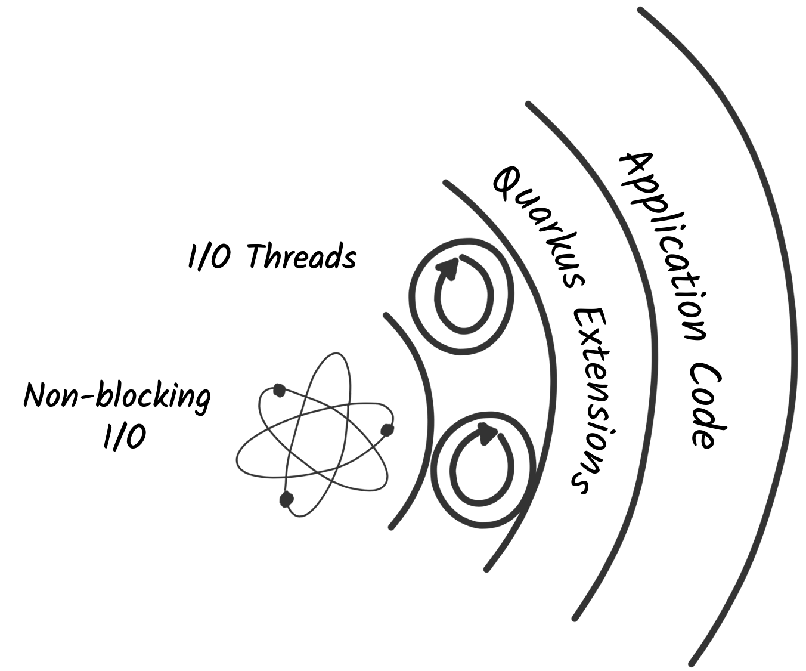
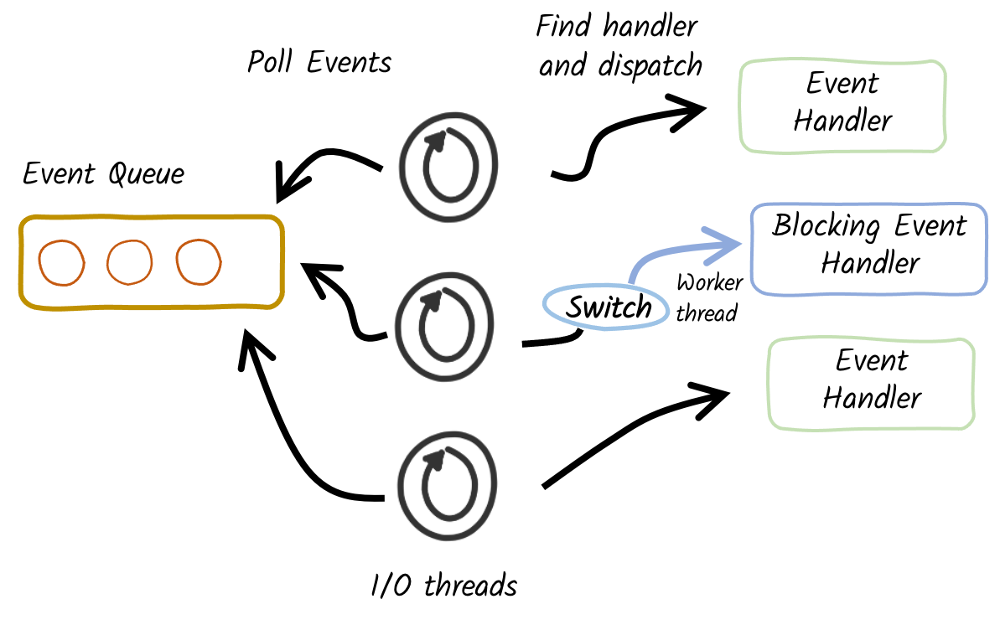

# 08 - Reactive in an imperative world

Code ???

https://quarkus.io/guides/quarkus-reactive-architecture

https://www.youtube.com/watch?v=kWlrGtwvOxg

https://quarkus.io/guides/mutiny-primer

## Qaurkus reactive core

**Efficiency** is essential, especially in the Cloud and in containerized environments. Resources, such as CPU and memory, are shared among multiple applications. Greedy applications that consume lots of memory are inefficient and put penalties on sibling applications. You may need to request more memory, CPU, or bigger virtual machines. It either increases your monthly Cloud bill or decreases your deployment density.

### The problem with I/O

I/O is an essential part of almost any modern system. Whether it is to call a remote service, interact with a database, or send messages to a broker, there are all I/O-based operations. Efficiently handling them is critical to avoid greedy applications. For this reason, **Quarkus uses non-blocking I/O**, which allows a *low number of OS threads to manage many concurrent I/Os*. As a result, Quarkus applications allow for higher concurrency, use less memory, and improve the deployment density.

### Reactive architecture

Quarkus uses `Vert.x` and `Netty` at its core to handle the non-blocking I/O interactions. And, it uses a bunch of reactive frameworks and extensions on top to help developers. Quarkus is not just for HTTP microservices, but also for event-driven architecture. Its **reactive nature makes it very efficient when dealing with messages** (e.g., Apache Kafka or AMQP).




Quarkus extensions and the application code can use this engine to orchestrate I/O interactions, interact with databases, send and receive messages, and so on.

What that helps with is a fast non-blocking code that handles almost everything going via the **event-loop thread** (**IO thread**). But, if you were creating a typical REST application or a client-side application, Quarkus also gives you the imperative programming model.

For example, Quarkus HTTP support is based on a non-blocking and reactive engine (Eclipse `Vert.x` and `Netty`). All the HTTP requests your application receive are handled by event loops (**IO Thread**) and then are routed towards the code that manages the request. Depending on the destination, it can invoke the code managing the request on a **worker thread** (servlet, Jax-RS) or use the **IO was thread** (reactive route).
For **messaging connectors**, **non-blocking clients are used and run on top of the Vert.x engine**. So, you can efficiently send, receive, and process messages from various messaging middleware.

## Execution models

While using non-blocking I/O has tremendous benefits, it does not come for free. Indeed, it introduces a new execution model quite different from the one used by classical frameworks.

### Traditional (imperative) execution model

**Traditional applications** use blocking I/O and an imperative (sequential) execution model. So, in an application exposing an HTTP endpoint, **each HTTP request is associated with a thread**. In general, *that thread is going to process the whole request and the thread is tied up serving only that request for the duration of that request*. When the processing requires interacting with a remote service, it uses **blocking I/O**. The thread is blocked, waiting for the result of the I/O. While that model is simple to develop with (as everything is sequential), it has a few drawbacks. To handle concurrent requests, you need multiple threads, so, you **need to introduce a worker thread pool**. The size of this pool constrains the concurrency of the application. In addition, each thread has a cost in terms of memory and CPU. Large thread pools result in greedy applications.


### Reactive execution models

As we have seen above, non-blocking I/O avoids that problem. **A few threads can handle many concurrent I/O**. If we go back to the HTTP endpoint example, the request processing is executed on one of these I/O threads. Because there are only a few of them, you need to use them wisely. **When the request processing needs to call a remote service**, you can’t block the thread anymore. You **schedule the I/O and pass a continuation**, i.e., the code to execute once the I/O completes.


## Reactive Programming Models


First, **Mutiny** is an intuitive, event-driven reactive programming library. With Mutiny, you write event-driven code. Your code is a pipeline receiving events and processing them. Each stage in your pipeline can be seen as a continuation, as Mutiny invokes them when the upstream part of the pipeline emits an event.

The Mutiny API has been tailored to improve the readability and maintenance of the codebase. Mutiny provides everything you need to orchestrate asynchronous actions, including concurrent execution. It also offers a large set of operators to manipulate individual events and streams of events.

## Unification of Imperative and Reactive

Changing your development model is not simple. It requires relearning and restructuring code in a non-blocking fashion. Fortunately, you don’t have to do it!

Quarkus is inherently reactive thanks to its reactive engine. But, you, as an application developer, **don’t have to write reactive code**. Quarkus **unifies reactive and imperative**. It means that you can write traditional blocking applications on Quarkus. But how do you avoid blocking the I/O threads? Quarkus implements a **proactor pattern** that **switches to worker thread when needed**.



Thanks to hints in your code (such as the `@Blocking` and `@NonBlocking` annotations), **Quarkus extensions can decide when the application logic is blocking or non-blocking**. If we go back to the HTTP endpoint example from above, the *HTTP request is always received on an I/O thread*. Then, the extension *dispatching that request to your code decides whether to call it on the I/O thread, avoiding thread switches, or on a worker thread*. This decision **depends on the extension**. For example, the `RESTEasy Reactive extension` uses the `@Blocking` annotation to determine if the method needs to be invoked using a worker thread, or if it can be invoked using the I/O thread.

Quarkus is pragmatic and versatile. You decide how to develop and execute your application. You can use the imperative way, the reactive way, or mix them, using reactive on the parts of the application under high concurrency.

### The `@Blocking` annotation

Developers need the ability to indicate which code is blocking, allowing the framework to offload the blocking code into a separate thread. Quarkus enables this with the `@Blocking` annotation for reactive messaging, as shown next.

```java
@Incoming("new-order") //Subscriber to the new-order channel
@Blocking //The method executes blocking code and runs the method on a thread that is not the execution loop thread
@Transactional    
public void handleNewOrder(NewOrder newOrder) {
    log.info("Processing received new order: {}", newOrder);
    Order order = createNewOrder(newOrder);
    orderUpdatesEmitter.send(toDto(order));
    orderRepository.persist(order); //this is the operation that needs to be exectued on the worker thread

}
```

`@Blocking` is a great annotation because it **enables developers to utilize Reactive Streams, while still executing more imperative, but blocking, code**. Without the annotation, executing blocking code would need an `Executor` to spawn another thread to perform the work and deal with propagating contexts between threads for CDI beans, database transactions, or any other context that might be on the current thread that is required to execute the method.

## Reactive streams

Reactive streams are necessary for the construction of reactive systems; see https://www.reactivemanifesto.org/ for further details. 
Reactive systems are an **architectural style** for designing responsive systems. The key characteristics of reactive systems are *resiliency, elasticity, and asynchronous message passing*.

### Publisher, Subscriber, and Processor
A **Publisher** is the first stage of a *Reactive Stream*, or pipeline; there is nothing before it.
Any pipeline of data always consists of a single Publisher to begin the stream.
A **Subscriber** is the final stage of a Reactive Stream. The stream completes with a Subscriber; *no further processing on that particular stream can occur*.
A **Processor** combines Subscriber and Publisher to **create a stage in the pipeline** that continues the stream. It will manipulate and act on the data in the stream in any way, but it will not create or end the stream it’s acting on.


### Back pressure

If there is no restriction on the number of messages that service A can send to service B, when service B is unable to process the messages it’s receiving in a timely manner, problems can occur with *response time*, *availability*, *robustness*, *network congestion*.

With **Back Pressure**, when service B subscribes to receive messages from service A, service A asks how many messages it would like. In this example, service B would like five messages. Service A dutifully sends across five messages for processing. Once service B has finished processing some of these messages, three in this case, service A will send three more messages. Notice that **service A never sends more messages than service B has said it can process at once**.


