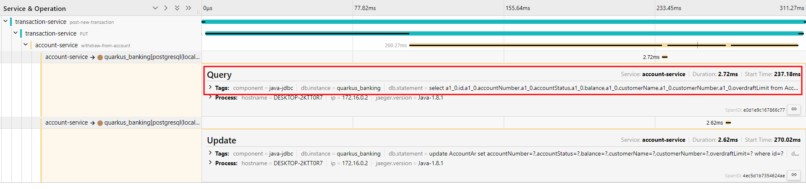

# 11 - Tracing microservices

Code: https://github.com/apedano/kubernetes-native-microservices-sources/tree/ch-09-tracing-microservices

In essence, tracing is a key tool in the operations toolbox for **observing** a running production system. It is the best means of debugging the **execution path** of a distributed system.


## Jaeger

Jaeger (www.jaegertracing.io/) is a distributed tracing system that facilitates **creating a view of the interaction between services** within a distributed system. It’s not the only tracing system available — Zipkin (https://zipkin.io/) is another.


### What are `traces` and `spans`?

A trace is a collection of operations that represents a unique transaction handled by an application and its constituent services. A span represents a single operation within a trace.


Because the collection of traces can be expensive in time and memory, compared to metrics, Jaeger provides the ability to define a **sampling rate** to indicate how many traces should be captured. In case of a critical application, it’s necessary to trace every execution if something
goes wrong (sampling rate = 1).

### Trace sampling

The type of sampling chosen impacts the number of traces captured within an application.

* **Constant** — The constant sampler always makes the same decision for every possible trace. All traces are sampled when set to 1, or ignored when set to 0. Most demo applications use a constant sampler with a value of `1` to capture all traces. For production, using constant sampling is beneficial only for applications that don’t have many requests; otherwise, the cost of storing the traces grows too quickly.
* **Probabilistic** — The probabilistic sampler uses weighting to determine the likelihood of sampling a trace. Given a value of `0.2`, for example, approximately two traces will be sampled out of 10 traces.
* **Rate limiting** — A leaky bucket rate limiter ensures traces are sampled at a constant rate. A value of `4.0` informs Jaeger to sample requests at a rate of four traces every second.
* **Remote** — Remote is the *default* sampling type used if no other configuration is set. The Jaeger agent provides the sampling type remotely, as defined by the configuration in the Jaeger backend.

### Openshift installation

In openshift/kubernetes Jaeger can be installed as an operator

### Docker compose installation

https://faun.pub/how-to-deploy-jaeger-with-docker-compose-d558c9b36e07

https://www.jaegertracing.io/docs/1.51/getting-started/

```yaml
jaeger:
    image: jaegertracing/all-in-one:latest
    ports:
      - "6831:6831/udp"
      - "16686:16686"
    networks:
      - quarkus-bank-network
```

The list of ports are:

| **Port** | **Protocol** | **Component** | **Function**                                                                                 |
| -------- | ------------ | ------------- | -------------------------------------------------------------------------------------------- |
| 6831     | UDP          | agent         | accept `jaeger.thrift` over Thrift-compact protocol (used by most SDKs)                      |
| 6832     | UDP          | agent         | accept `jaeger.thrift` over Thrift-binary protocol (used by Node.js SDK)                     |
| 5775     | UDP          | agent         | (deprecated) accept zipkin.thrift over compact Thrift protocol (used by legacy clients only) |
| 5778     | HTTP         | agent         | serve configs (sampling, etc.)                                                               |
| 16686    | HTTP         | query         | serve frontend                                                                               |
| 4317     | HTTP         | collector     | accept OpenTelemetry Protocol (OTLP) over gRPC                                               |
| 4318     | HTTP         | collector     | accept OpenTelemetry Protocol (OTLP) over HTTP                                               |
| 14268    | HTTP         | collector     | accept `jaeger.thrift` directly from clients                                                   |
| 14250    | HTTP         | collector     | accept model.proto                                                                           |
| 9411     | HTTP         | collector     | Zipkin compatible endpoint (optional)                                                        |

Once started the GUI is reacheable at http://localhost:16686/search

Now that Jaeger is installed, in the next section, we trace the microservices, showing
how they appear in the Jaeger console.

## Microservice tracing with Jaeger

For each service, we can add the dependency and the properties config to have the default tracing running.

```xml
<!--    Microprofile Opentracing impl - Jeager -->
<dependency>
  <groupId>io.quarkus</groupId>
  <artifactId>quarkus-smallrye-opentracing</artifactId>
</dependency>
```

```properties
#URL for the Jaeger collector. Microservices send any traces to the collector. Defining it as a
#production configuration means the default URL, http://jaeger-collector:14268/api/traces, will work
#running locally with Docker
%prod.quarkus.jaeger.endpoint=http://simplest-collector.observability:14268/api/traces
%staging.quarkus.jaeger.endpoint=http://jeager:14268/api/traces
#the name given to app spans in traces
quarkus.jaeger.service-name=account-service
#the sample type: const, probabilistic, rate-limiting, and remote
quarkus.jaeger.sampler-type=const
#in conjunction with sampler-type, in this case 1 means all ops are logged
quarkus.jaeger.sampler-param=1
```

The GUI (port `16686` exposed in Docker compose) will show the services that have sent the trace info to the collector.


## Tracing specifications

### OpenTracing

**OpenTracing** (https://opentracing.io/) consists of an API pecification and frameworks and libraries implementing the specification for various languages. OpenTracing itself **is not a standard**, because it is not part of any official standards body.
The OpenTracing project is part of the *Cloud Native Computing Foundation* (**CNCF**) (https://www.cncf.io/).
OpenTracing and Jaeger have seen wide adoption within the open source community and within enterprises needing to trace their services.

#### MicroProfile OpenTracing

**MicroProfile OpenTracing** chose to build upon the foundations of *OpenTracing* and not define its own API for creating or interacting with traces. `SpanContext` information is extracted from incoming JAX-RS requests (every JAX-RS resource method has a new `Span` of its execution). This ensures *tracing of every JAX-RS endpoint in a microservice* by default. MicroProfile OpenTracing adds the `@Traced` annotation for developers to indicate that specific methods, or all methods on a class, should have a `Span` created to represent the processing of the method. `@Traced`
can be used on non-JAX-RS resource methods to have spans created, and the creation of a Span can be prevented by adding `@Traced(value = false)` onto a method. `@Traced` can modify the default span name for any traced method. The default for inbound requests follows:

`<HTTP-method>:<package-name>.<class-name>.<method-name>`

However, the span name can be overridden with `@Traced(operationName = "mymethod")`.

## Customizing application tracing

### Using `@Trade` 

In the `AccountResourceAR` we can use the annotation to give a name to the corresponding span

```java
@PUT
@Path("/{accountNumber}/withdraw")
...
@Traced(operationName = "withdraw-from-account")
public CompletionStage<AccountAr> withdrawal(@PathParam("accountNumber") Long accountNumber,String amount)
```


### Injecting a `Tracer`


```
public class AccountResourceAR {

  @Inject
  Tracer tracer; //OpenTracing tracer
  ...
  public CompletionStage<AccountAr> withdrawal(@PathParam("accountNumber") Long accountNumber, String amount) {
      ...
      tracer.activeSpan().setTag("accountNumber", accountNumber);
      tracer.activeSpan().setBaggageItem("withdrawalAmount", amount);
      ...
  }
```


### Tracing database calls

First we add a tracing dependency for JDBC

```xml
<dependency>
 <groupId>io.opentracing.contrib</groupId>
 <artifactId>opentracing-jdbc</artifactId>
</dependency>
```

The JDBC tracer from OpenTracing sits **between a service and the database**. For that to work, an application needs to know the tracer **must be used instead of the driver for a specific database**.

It’s also necessary to inform Hibernate which database is being
used, because it’s no longer possible to deduce it from the JDBC driver.

```properties
%prod.quarkus.datasource.jdbc.url=jdbc:tracing:postgresql://localhost:5432/quarkus_banking
#Specifies the JDBC driver for tracing. With multiple JDBC drivers on the class path, PostgreSQL, and Tracing, it’s necessary to specify which one to use.
%prod.quarkus.datasource.jdbc.driver=io.opentracing.contrib.jdbc.TracingDriver
#Informs Hibernate that the underlying database type is PostgreSQL. Without this configuration property, Quarkus is unable to determine the database type from the chosen driver.
%prod.quarkus.hibernate-orm.dialect=org.hibernate.dialect.PostgreSQL10Dialect
```

In the docker compose the configuration becomes:

```yaml
  account-service:
    environment:
      - QUARKUS_DATASOURCE_JDBC_URL=jdbc:tracing:postgresql://db:5432/quarkus_banking
      - QUARKUS_DATASOURCE_JDBC_DRIVER=io.opentracing.contrib.jdbc.TracingDriver
      - quarkus.hibernate-orm.dialect=org.hibernate.dialect.PostgreSQL10Dialect
```



### Tracing Kafka messages

As we did for the JDBC calls, we add the dependency

```
<dependency>
  <groupId>io.opentracing.contrib</groupId>
  <artifactId>opentracing-kafka-client</artifactId>
</dependency>
```

The dependency adds kafka interceptors for incoming and outgoing channels we have to add to the configuration.

`account-service application-properties`

For incoming channel

```properties
mp.messaging.incoming.overdraft-update.interceptor.classes=io.opentracing.contrib.kafka.TracingConsumerInterceptor
```

For outgoing channel

```properties
mp.messaging.outgoing.account-overdrawn.interceptor.classes=io.opentracing.contrib.kafka.TracingProducerInterceptor
```

That's enough to add Kafka spans to the traces (done on the `overdraft-service` as well)


## Combining traces

If we do a call to `transaction-service` to trigger the overdrawn handling, we have the following:

**Trace1**


**Trace2**


Becasue they belong to the same process, it would be preferable if the two traces are merged into one to improve observability.

Notice the points where trace continuation breaks is when moving from JAX-RS to Kafka, and also between receiving a Kafka message and sending out another one.

### Merging JAX-RS with Messaging (Kafka)

The first step is propagating the trace from JAX-RS to Kafka. Instead of calling `emitter.send(payload)`, we need to add information about the trace to the Kafka message, as shown next. We do this, by injecting the active span info (the one for the JAX-RS), to the Kafka record metadata in the message we sent to the outgoing channel

```java
  @PUT
  @Path("/{accountNumber}/withdraw")
  @Produces(MediaType.APPLICATION_JSON)
  @Transactional
  @Traced(operationName = "withdraw-from-account")
  public CompletionStage<AccountAr> withdrawal(@PathParam("accountNumber") Long accountNumber, String amount) {
    ...
    return handleOverdrawn(entity);
    ...
  }

  private CompletionStage<AccountAr> handleOverdrawn(AccountAr entity) {
        //Creates an instance of Kafka RecordHeaders. The headers are added to the Kafka message, enabling
        //the information on them to be available in consumers
        RecordHeaders headers = new RecordHeaders();
        //Uses the TracingKafkaUtils utility class to inject the details of the trace and span into the
        //RecordHeaders instance created in the previous line
        TracingKafkaUtils.inject(tracer.activeSpan().context(), headers, tracer);
        //Creates an OutgoingKafkaRecordMetadata instance and sets the RecordHeaders instance on it. This
        //metadata instance can be used to set Kafka-specific metadata on an outgoing message.
        OutgoingKafkaRecordMetadata<Object> kafkaMetadata =
                OutgoingKafkaRecordMetadata.builder()
                        .withHeaders(headers)
                        .build();
        CompletableFuture<AccountAr> outputFuture = new CompletableFuture<>();
        Overdrawn overdrawn = new Overdrawn(entity);
        Message<Overdrawn> message =
                Message.of(overdrawn)
                        .addMetadata(kafkaMetadata)
                        .withAck(() -> {
                            log.info("The account #{} overdrawn has been acked", entity.accountNumber);
                            outputFuture.complete(entity);
                            return CompletableFuture.completedFuture(null);
                        })
                        .withNack(throwable -> {
                            log.info("The account #{} overdrawn has been nacked", entity.accountNumber);
                            outputFuture.completeExceptionally(throwable);
                            return CompletableFuture.completedFuture(null);
                        });
        log.info("Sending account overdrawn notification");
        emitter.send(message); //this is a void method
        return outputFuture; //we return
    }

```

On the other side of the Kafka topic, the Overdraft service needs to retrieve the span information. Doing so involves two steps: extracting the span information from Kafka headers, and then creating a child span for additional method calls.

```java
@Incoming("account-overdrawn")
@Outgoing("customer-overdrafts")
public Message<Overdrawn> overdraftNotification(Message<Overdrawn> message) {
    log.info("Received account overdrawn");
    Overdrawn overdrawnPayload = message.getPayload();

    CustomerOverdraft customerOverdraft = customerOverdrafts.get(overdrawnPayload.customerNumber);

    ...

    AccountOverdraft accountOverdraft = customerOverdraft.accountOverdrafts.get(overdrawnPayload.accountNumber);
    ...

    customerOverdraft.totalOverdrawnEvents++;
    accountOverdraft.currentOverdraft = overdrawnPayload.overdraftLimit;
    accountOverdraft.numberOverdrawnEvents++;

    RecordHeaders headers = new RecordHeaders();
    //Verifies there is IncomingKafkaRecordMetadata in the metadata; otherwise doesn’t handle traces
    if (message.getMetadata(IncomingKafkaRecordMetadata.class).isPresent()) {
        //we build the span for this operation
        Span span = tracer.buildSpan("process-overdraft-fee")
          //Makes the new span a child of the span extracted from the Kafka message on the next line
          .asChildOf(
            //context from the incoming message headers
            TracingKafkaUtils.extractSpanContext(
                    message.getMetadata(IncomingKafkaRecordMetadata
                            .class).get().getHeaders(),
                    tracer))
          .start();
        //the scope of the span is autoclosable
        try (Scope scope = tracer.activateSpan(span)) {
            //Retrieves the current span context, and injects it into RecordHeaders
            TracingKafkaUtils.inject(span.context(), headers, tracer);
        } finally {
            span.finish();
        }
    }
    //In addition to the metadata about the customer overdraft, also attaches metadata for
    //OutgoingKafkaRecordMetadata containing the trace headers
    OutgoingKafkaRecordMetadata<Object> kafkaMetadata =
            OutgoingKafkaRecordMetadata.builder()
                    .withHeaders(headers)
                    .build();
    log.info("Notifying customer overdraft");
    return message.addMetadata(kafkaMetadata);
}
```

And in the transaction service as well where the `overdraft-fee` is received.
This is the trace with all the span for the process

