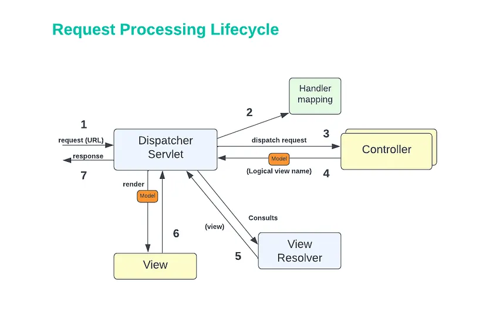

# Spring Boot Security

## MVC flow without Spring security



The `DispatcherServlet` is the front controller which intercepts 
any HTTP Request and forwards it to the right controller. 
Spring Boot automatically configures the DispatcherServlet.

1. Request lands at Spring’s `DispatcherServlet`
2. `DispatcherServlet` creates an **IOC container**. The IOC container is a _central component of the Spring Framework that manages the creation and dependencies of beans_.
   The `DispatcherServlet` creates a `WebApplicationContext` through the `ContextLoaderListener`, based on the configuration files, which is a specialized IOC container that is used for web applications. The `DispatcherServlet` will use the IOC container to lookup the controller bean via the **handler mapping**. The hanlder mapping will check the by using the URL and request parameters to find the reference to the mvc bean to handle the request.
3. `DispatcherServlet` dispatches that request to the selected controller.
4. Spring MVC’s controller executes the business logic by using business services of the application and it creates the **model** which wraps the information to be carried back to the user. Spring MVC’s controller also returns a **logic view name** along with the model.
5. `DispatcherServlet` uses the **view resolver**. According to the configured `ViewResolver`, it resolves the actual view name instead of the logic view name.
6. `DispatcherServlet` renders the model to the view.
7. Finally, that information creates a response, and returns it to the user’s browser by DispatcherServlet.

### `DispatcherServlet` and `ContextLoaderListener` initialization

In a Servlet 3.0 environment, the container looks for any classes in the classpath that implement the `javax.servlet.ServletContainerInitializer` interface; if any are found, they’re used to configure the servlet container.

Spring provides the `SpringServletContainerInitializer` that looks for an implementation of `WebApplicationInitializer`.

Spring supports two ways to initialize the servlet container:

* **XML**: `web.xml` is the root file of any web application, placed in `/WEB-INF`. It has a servlet specification, and contains all the servlet configuration to be bootstrapped.
* **JAVA**: by extending `AbstractAnnotationConfigDispatcherServletInitializer` as implementation of the `WebApplicationInitializer`

The used initializer creates:

* `DispatcherServlet` 
* `ContextLoaderListener` : 

Like any other **Servlet listener**, the `ContextLoaderListener` listens for startup and shutdown of the server by implementing `ServletContextListener` and accordingly creates
and destroys Spring-managed beans in the `WebApplicationContext` it creates.
It also provides access to the `ServletContext` via `ServletContextAware` beans and the `getServletContext()`
method.

## Spring security


Just as in traditional servlet web applications, we can have multiple filters to create pre and post 
elaboration for servlet requests as in the diagram


Spring has its internal `SecurityFilterChain` which implements the **chain of responsibility pattern**. 
It intercepts the calls to the spring application before forwarding it to the `DispatcherServlet`.

#### `DelegatingFilterProxy`

Spring provides a `Filter` implementation named `DelegatingFilterProxy` that allows 
**bridging between the Servlet container’s lifecycle and Spring’s ApplicationContext**.
The Servlet container allows registering Filter instances by using its own standards, 
but it is not aware of Spring-defined Beans. You can register DelegatingFilterProxy through the standard
Servlet container mechanisms but **delegate all the work to a Spring Bean that implements Filter**.

The class implements the method `doFilter()` which delegates the logic to the spring bean.

```java
public void doFilter(ServletRequest request, ServletResponse response, FilterChain chain) {
	Filter delegate = getFilterBean(someBeanName); 
	delegate.doFilter(request, response); 
}
```

#### `FilterChainProxy`
A spring application can define **multiple SecurityFilterChain instances, for different internal realms**. 

The selection of the correct chain is delegated to the `FilterChainProxy`, which is also an implementation of `Filter`,
therefore it has to be wrapped into a `DelegatingFilterProxy`


### `SecurityFilterChain`

The `SecurityFilterChain` implements the **chain of responsibility pattern**; it intercepts the calls before forwarding it to the `DispatcherServlet`.
This can be configured as a sequence of filters like

```java
@Configuration
@EnableWebSecurity
public class SecurityConfig {

    @Bean
    public SecurityFilterChain filterChain(HttpSecurity http) throws Exception {
        http
            .csrf(Customizer.withDefaults())
            .authorizeHttpRequests(authorize -> authorize
                .anyRequest().authenticated()
            )
            .httpBasic(Customizer.withDefaults())
            .formLogin(Customizer.withDefaults());
        return http.build();
    }

}
```

1. First, the CsrfFilter is invoked to protect against CSRF attacks.
2. Second, the authentication filters are invoked to authenticate the request.
2. Third, the AuthorizationFilter is invoked to authorize the request.

The list of used filters is printed at application bootstrap at INFO level.
```
o.s.s.web.DefaultSecurityFilterChain     : Will secure any request with [
   org.springframework.security.web.session.DisableEncodeUrlFilter@404db674,
   ....context.request.async.WebAsyncManagerIntegrationFilter@50f097b5,
   ....context.SecurityContextHolderFilter@6fc6deb7,
   ....header.HeaderWriterFilter@6f76c2cc,
   ....csrf.CsrfFilter@c29fe36,
   ....authentication.logout.LogoutFilter@ef60710,
   ....authentication.UsernamePasswordAuthenticationFilter@7c2dfa2,
   ....authentication.ui.DefaultLoginPageGeneratingFilter@4397a639,
   ....authentication.ui.DefaultLogoutPageGeneratingFilter@7add838c,
   ....authentication.www.BasicAuthenticationFilter@5cc9d3d0,
   ....savedrequest.RequestCacheAwareFilter@7da39774,
   ....servletapi.SecurityContextHolderAwareRequestFilter@32b0876c,
   ....authentication.AnonymousAuthenticationFilter@3662bdff,
   ....access.ExceptionTranslationFilter@77681ce4,
   ....access.intercept.AuthorizationFilter@169268a7]
```

## Servlet authentication architecture

* `SecurityContextHolder` - where Spring Security stores the details of who is authenticated.

* `SecurityContext` - is obtained from the `SecurityContextHolder` and contains the `Authentication` of the currently authenticated user.

* `Authentication` - Can be the input to `AuthenticationManager` to provide the credentials a user has provided to authenticate or the current user from the `SecurityContext`.
  * _principal_: Identifies the user. When authenticating with a username/password this is often an instance of `UserDetails`.

  * _credentials_: Often a password. In many cases, this is cleared after the user is authenticated, to ensure that it is not leaked.

   * _authorities_: The GrantedAuthority instances are high-level permissions the user is granted. Two examples are roles and scopes.

* `GrantedAuthority` - An authority that is granted to the principal on the Authentication (i.e. **roles**, **scopes**, etc.)

* `AuthenticationManager` - the API that defines **how Spring Security’s Filters perform authentication**.

* `ProviderManager` - the most common **implementation of `AuthenticationManager`**.

* `AuthenticationProvider` - used by `ProviderManager` to **perform a specific type of authentication**.

* Request Credentials with AuthenticationEntryPoint - used for requesting credentials from a client (i.e. redirecting to a log in page, sending a WWW-Authenticate response, etc.)

* **AbstractAuthenticationProcessingFilter** - a **base `Filter` used for authentication**. This also gives a good idea of the high level flow of authentication and how pieces work together.

### `SecurityContextHolder`


By default, it uses a `ThreadLocal` to store these details, which means that the `SecurityContext` **is always available to methods in the same thread**, 
even if the `SecurityContext` is not explicitly passed around as an argument to those methods. 
Using a ThreadLocal in this way is quite **safe if you take care to clear the thread after the present principal’s request is processed**. 
Spring Security’s `FilterChainProxy` ensures that the `SecurityContext` is always cleared.

```java
//getting the SecurityContext
SecurityContext context = SecurityContextHolder.getContext();
Authentication authentication = context.getAuthentication();
String username = authentication.getName();
Object principal = authentication.getPrincipal();
Collection<? extends GrantedAuthority> authorities = authentication.getAuthorities();
```

```java
//setting the SecurityContext
SecurityContext context = SecurityContextHolder.createEmptyContext();
Authentication authentication =
        new TestingAuthenticationToken("username", "password", "ROLE_USER"); 
context.setAuthentication(authentication);

SecurityContextHolder.setContext(context); 
```

### `ProviderManager` 

`ProviderManager` is the most commonly used implementation of `AuthenticationManager`.
`ProviderManager` delegates to a List of `AuthenticationProvider` instances. 
Each `AuthenticationProvider` has an opportunity to indicate that authentication should be successful, fail, 
or indicate it cannot make a decision and allow a downstream `AuthenticationProvider` to decide. 
If none of the configured `AuthenticationProvider` instances can authenticate, authentication fails with a `ProviderNotFoundException`, 
which is a special `AuthenticationException` that indicates that the `ProviderManager` was not configured to support the type of Authentication that was passed into it.


### `AuthenticationProvider`

You can inject multiple AuthenticationProviders instances into `ProviderManager`. 
Each AuthenticationProvider performs a specific type of authentication. 
For example, `DaoAuthenticationProvider` supports username/password-based authentication, 
while `JwtAuthenticationProvider` supports authenticating a JWT token.

### `AbstractAuthenticationProcessingFilter`

`AbstractAuthenticationProcessingFilter` is used as a base `Filter` for authenticating a user’s credentials. 
Before the credentials can be authenticated, Spring Security typically requests the credentials by using `AuthenticationEntryPoint`.


1. When the user submits their credentials, the `AbstractAuthenticationProcessingFilter` creates an
   `Authentication` from the `HttpServletRequest` to be authenticated. The type of Authentication created depends on the subclass of `AbstractAuthenticationProcessingFilter`. 
    For example, `UsernamePasswordAuthenticationFilter` creates a `UsernamePasswordAuthenticationToken`.
2. Next, the `Authentication` is passed into the `AuthenticationManager` to be authenticated.
3. If authentication fails, then `Failure`.
    1. The `SecurityContextHolder` is cleared out.
    2. `RememberMeServices.loginFail()` is invoked. If remember me is not configured, this is a no-op. See the rememberme package.
    3. `AuthenticationFailureHandler` is invoked. See the AuthenticationFailureHandler interface.
4. If authentication is successful, then `Success`.
   1. `SessionAuthenticationStrategy` is notified of a new login. See the SessionAuthenticationStrategy interface.
   2. The `Authentication` is set on the `SecurityContextHolder`. Later, if you need to save the SecurityContext so that it can be automatically set on future requests, `SecurityContextRepository#saveContext` must be explicitly invoked. See the SecurityContextHolderFilter class. 
   3. `RememberMeServices.loginSuccess` is invoked. If remember me is not configured, this is a no-op. See the rememberme package.
   4. `ApplicationEventPublisher` publishes an `InteractiveAuthenticationSuccessEvent`.
   5. `AuthenticationSuccessHandler` is invoked. See the AuthenticationSuccessHandler interface.

## Authorization flow


1. The `AuthorizationFilter` constructs a `Supplier` that retrieves an `Authentication` from the `SecurityContextHolder`.

2. It passes the `Supplier<Authentication>` and the `HttpServletRequest` to the `AuthorizationManager`. The `AuthorizationManager` matches the request to the patterns in **authorizeHttpRequests**, and runs the corresponding rule.

3. If authorization is denied, an `AuthorizationDeniedEvent` is published, and an `AccessDeniedException` is thrown. In this case the ExceptionTranslationFilter handles the AccessDeniedException.

4. If access is granted, an `AuthorizationGrantedEvent` is published and AuthorizationFilter continues with the FilterChain which allows the application to process normally.

The `AuthorizationFilter` **is last in the Spring Security filter chain by default**. 
This means that Spring Security’s authentication filters, exploit protections, and other filter integrations do not require authorization. 
If you add filters of your own before the AuthorizationFilter, they will also not require authorization; otherwise, they will.

### Authorizing an endpoint

```java
@Bean
SecurityFilterChain web(HttpSecurity http) throws Exception {
    http
        // ...
        .authorizeHttpRequests(authorize -> authorize                                  
        .dispatcherTypeMatchers(FORWARD, ERROR).permitAll()
        .requestMatchers("/static/**", "/signup", "/about").permitAll()         
        .requestMatchers("/admin/**").hasRole("ADMIN")                             
        .requestMatchers("/db/**").access(allOf(hasAuthority('db'), hasRole('ADMIN')))   
        .anyRequest().denyAll()                                                
        );
	return http.build();
}
```

As a quick summary, here are the authorization rules built into the DSL:

* `permitAll` - The request requires no authorization and is a public endpoint; note that in this case, the Authentication is never retrieved from the session
* `denyAll` - The request is not allowed under any circumstances; note that in this case, the Authentication is never retrieved from the session
* `hasAuthority` - The request requires that the Authentication have a GrantedAuthority that matches the given value
* `hasRole` - A shortcut for hasAuthority that prefixes ROLE_ or whatever is configured as the default prefix
* `hasAnyAuthority` - The request requires that the Authentication have a GrantedAuthority that matches any of the given values
* `hasAnyRole` - A shortcut for hasAnyAuthority that prefixes ROLE_ or whatever is configured as the default prefix
* `access` - The request uses this custom AuthorizationManager to determine access

